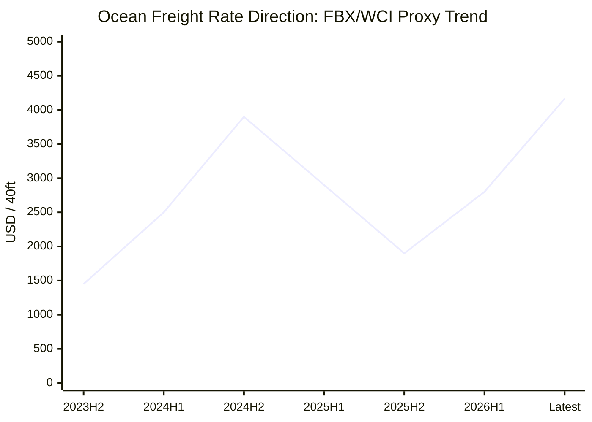
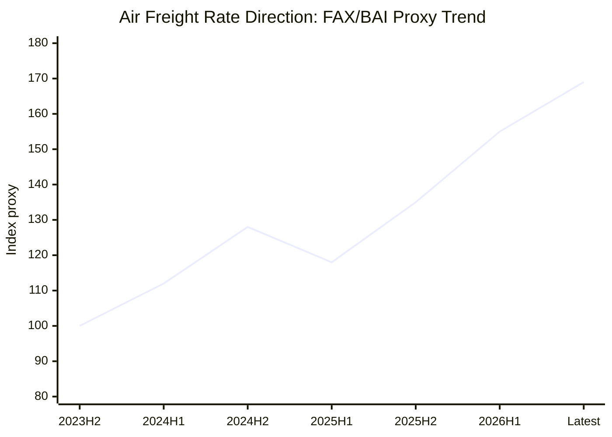

# Global Logistics Market Weekly Report – July 1, 2026 Week

**Report date:** 2026-07-01  
**주차 기준:** ISO Week 27  
**파일명:** `2026-W27.md`  
**Repo target:** `content/analyst-notes/2026-W27.md`

---

## 1. Ocean Freight Market Trends

### 1.1 Major Ocean Freight Index Updates

| Index | Latest date | Latest value | WoW | YoY | Key reading |
|---|---:|---:|---:|---:|---|
| SCFI | 2026-06-26 | 3,239.64 pts | +3.78% | +74.03% | Shanghai outbound spot market remains elevated |
| Drewry WCI | 2026-06-25 | USD 4,166 / 40ft | +5% | +39.66% | Highest level since Sep 2024 |
| Freightos FBX Global | 2026-07-01 check | USD 3,426.80 / 40ft | N/A | N/A | Global spot container rate remains high |
| XSI-C Far East → USWC | 2026-06-30 | USD 5,917 / FEU | N/A | N/A | Transpacific FAK remains under upward pressure |

**Analysis:**  
The container market is now being driven by three overlapping forces: early peak-season frontloading, U.S. tariff uncertainty, and Middle East-related fuel/routing risk. The strongest pressure is on Asia–U.S. lanes, especially Shanghai–Los Angeles and Shanghai–New York. Drewry reported Shanghai–Los Angeles at USD 5,750/40ft and Shanghai–New York at USD 7,149/40ft in the latest WCI update.

### 1.2 Ocean Freight Demand and Volume Trends

| Region | Latest signal | Interpretation |
|---|---|---|
| U.S. imports | May 2026 imports reached 2,428,758 TEU, +6.6% MoM, +11.5% YoY | Frontloading is visible |
| U.S. West Coast | Port of LA May imports +26% YoY | Retailers are pulling cargo forward |
| Asia exports | China PMI remained expansionary in June | Production base still supports export flows |
| Europe | Demand stable but cautious | Higher rates and ECB tightening may cap demand |

Demand is not “strong everywhere.” The real story is timing distortion. U.S. importers are pulling forward shipments to avoid future tariffs, fuel surcharges, and possible disruption. This creates a temporary demand spike that can lift spot rates even if final consumer demand is not structurally booming.

### 1.3 Vessel Capacity Supply and Freight Rate Outlook

New vessel deliveries continue to add nominal capacity, but effective capacity is constrained by longer routing, fuel cost volatility, and carrier capacity management. Drewry noted limited blank sailings, but that does not mean the market is loose. The bottleneck is not just vessel count; it is usable weekly capacity on specific lanes.

**Outlook:**  

- Asia–U.S.: elevated through July unless tariff frontloading fades sharply.
- Asia–Europe: high but less explosive than Transpacific.
- Mediterranean: still vulnerable to Red Sea and Middle East risk.
- Korea/Vietnam origins: may remain slightly more stable than Shanghai-origin cargo, but rate contagion is likely.

---

## 2. Air Freight Market Trends

### 2.1 Air Freight Rates and Demand Updates

| Indicator | Latest date | Latest reading | Interpretation |
|---|---:|---:|---|
| IATA global CTK | Apr 2026 | +4.0% YoY | Demand growth continues |
| IATA ACTK | Apr 2026 | -0.4% YoY | Capacity lag supports rates |
| Middle East CTK | Apr 2026 | -18.2% YoY | Gulf disruption remains material |
| FAX China → Europe | 2026-07-01 check | USD 4.58/kg | Still elevated |
| FAX North America → Greater China | 2026-07-01 check | USD 1.68/kg | Lower backhaul pricing |
| BAI/TAC | Jun 2026 | +37.3% YoY reported for BAI00 | Air rates remain high despite fuel easing |

### 2.2 Air Freight Market Issues and Outlook

Air freight is not simply benefiting from e-commerce growth. The more important near-term factor is capacity distortion. Middle East carriers remain a drag, and Gulf-related routing uncertainty limits belly and freighter flexibility. E-commerce still supports China outbound volumes, but de minimis rule changes reduce the easy arbitrage that supported ultra-fast cross-border parcel growth.

**Outlook:**  

- China–North America: stable-to-firm due to e-commerce and inventory urgency.
- China–Europe: mixed; capacity availability is better than North America but Gulf disruption matters.
- Europe–North America: softer than Asia outbound routes.
- Time-critical cargo should be quoted separately from deferred cargo.

---

## 3. Policy and Macroeconomic Issues

### 3.1 Trump 2.0 Tariff Policies and Trade Disputes

The U.S. tariff environment is now one of the main freight-rate drivers. The Trump administration has proposed additional tariffs of up to 12.5% on imports from around 60 economies, citing forced-labor enforcement concerns. This includes major trading partners and has triggered strong objections from affected economies. For logistics, the legal justification is less important than the behavioral effect: importers are accelerating orders before tariff exposure becomes clearer.

This creates artificial demand. The market can look strong even when underlying consumption is not. That is the trap. If forwarders interpret the current rate spike as pure demand recovery, they may overestimate long-term rate durability. The more accurate read is that this is a risk-premium market: cargo owners are buying time, not necessarily buying more goods.

Retaliatory tariff risk also matters. If Europe, Canada, or Asian partners respond, trade flows may shift from direct lanes to alternative sourcing and transshipment patterns. That increases documentation, HS-code scrutiny, origin verification, and compliance cost. For forwarders, the opportunity is not only freight margin; it is advisory work around routing, customs, origin strategy, and landed-cost visibility.

### 3.2 De Minimis and E-Commerce

The de minimis issue remains important for air freight. If low-value parcel exemptions are restricted further, cross-border e-commerce flows could shift from pure air parcel channels toward consolidated air, sea-air, bonded warehouse, and domestic fulfillment models. This would weaken some express-heavy demand but support 3PL warehousing, customs brokerage, and parcel distribution inside destination markets.

Forwarders should not assume e-commerce equals permanent air cargo strength. The channel mix can change quickly if regulation changes. The winners will be operators that can offer customs, bonded storage, fulfillment, and multi-modal alternatives.

### 3.3 Red Sea, Strait of Hormuz, and Energy Risk

Red Sea disruption remains unresolved, and normal Suez routing has not fully returned. At the same time, the Strait of Hormuz shock has affected fuel markets, tanker flows, and Gulf-linked air capacity. Even when oil prices ease temporarily, freight rates do not immediately fall because carriers price uncertainty into surcharges and contract negotiations.

For ocean freight, longer Cape of Good Hope routing reduces effective vessel supply. For air freight, Gulf hub disruption reduces network flexibility. For customers, this means ETA reliability is now as important as base freight. A cheap rate with unstable routing can become more expensive once demurrage, detention, missed delivery windows, and inventory stockout risks are included.

### 3.4 Monetary Policy and Economic Outlook

The Federal Reserve kept the federal funds target range at 3.50%–3.75% in June 2026. The key message is not easing; it is cautious restraint. Inflation is still above target and energy risk complicates the outlook. This keeps financing costs elevated for importers, retailers, and inventory-heavy businesses.

The ECB raised its three key policy rates by 25 bps in June 2026, taking the deposit facility to 2.25%, main refinancing rate to 2.40%, and marginal lending facility to 2.65%. Europe is therefore not in a clean demand-recovery cycle. Higher rates can suppress consumption and inventory restocking, even if supply chain costs are rising.

China’s manufacturing PMI remained above 50 in June, showing industrial resilience. However, export orders remain a weak point. China’s economy is still relying heavily on industrial output and external demand rather than a fully rebalanced domestic consumption engine. This means Asia export supply remains available, but demand visibility is fragile.

**Policy conclusion:**  
The logistics market is being shaped by policy volatility more than normal seasonality. Tariffs pull demand forward. Monetary tightening caps final demand. Geopolitics raises fuel and routing risk. This combination creates short-term rate spikes but unstable medium-term visibility.

---

## 4. Comprehensive Impact on Ocean and Logistics Sectors

| Area | Impact | Practical response |
|---|---|---|
| Ocean FCL | Spot rates rising, especially Transpacific | Shorter quote validity, early booking |
| LCL | FCL increases will pass through with lag | Separate base rate and surcharge clearly |
| Air freight | Rates stay high due to capacity distortion | Offer direct, deferred, and sea-air options |
| Customs | Tariff uncertainty increases compliance burden | Add HS/origin review to sales process |
| Warehousing | Frontloading increases inventory pressure | Promote bonded/temporary storage |
| Risk management | ETA and fuel surcharge volatility rising | Add risk clauses to quotations |

The market is not simply “good” or “bad.” It is unstable. That is where forwarders can make money if they act like advisors, not rate messengers. Customers need a clear explanation of why rates are moving, how long quotations remain valid, and what operational risks are hidden behind cheap options.

---

## 5. Conclusion and Recommendations

**Emphasized conclusion:**  
The July 2026 logistics market is entering a high-volatility phase. Ocean rates are rising faster than normal seasonality would justify, air freight remains structurally expensive, and policy risk is now directly shaping booking behavior.

**Recommended actions:**  

1. Keep Transpacific quote validity short: 3–5 days maximum.
2. Separate base ocean freight, fuel surcharge, peak surcharge, and premium space.
3. For U.S.-bound cargo, explain tariff-frontloading risk directly to customers.
4. For air cargo, avoid one-price quoting; provide standard, deferred, and express options.
5. Build weekly customer-facing market notes from this report instead of sending only rate sheets.

---

## 6. Source Labels

- Drewry WCI, June 25, 2026
- Shanghai Shipping Exchange / SCFI, June 26, 2026
- Freightos FBX and FAX public index pages
- Xeneta / Compass XSI-C public route index
- Descartes May 2026 Global Shipping Report
- IATA April 2026 Air Cargo Market Analysis
- Reuters / Financial Times / ECB / Federal Reserve / China PMI sources
