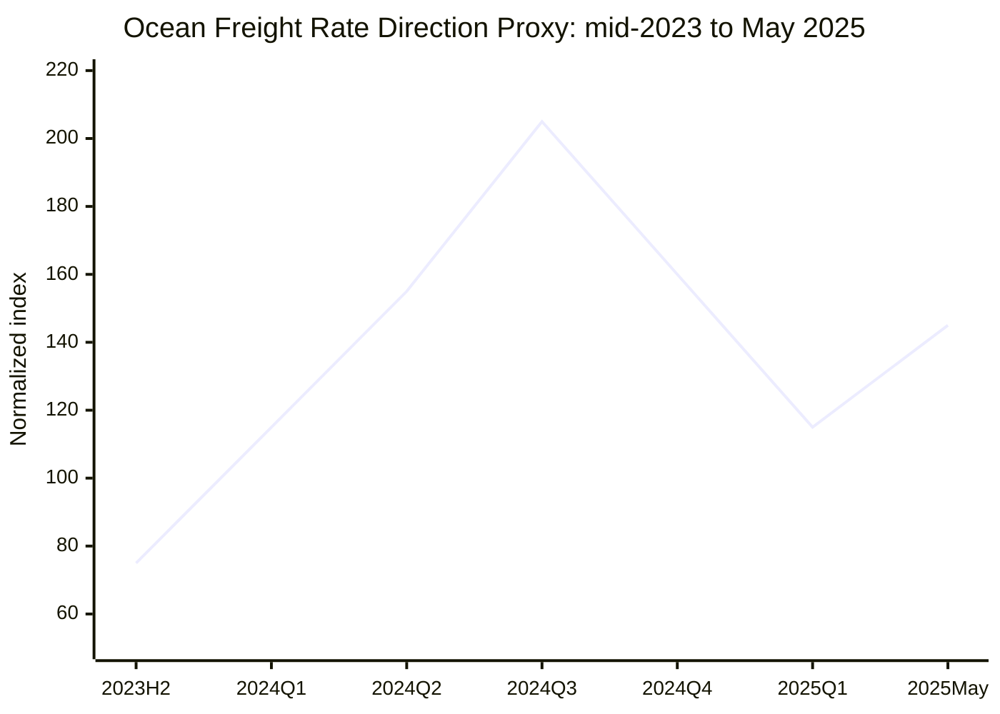

# Global Logistics Market Weekly Report – 2026-07-08 Week

**Report date:** 2026-07-08  
**주차 기준:** ISO Week 28  
**작성 언어:** Korean  
**파일명:** `2026-W28.md`  
**데이터 성격:** 공개 데이터, 공개 보도, 일부 유료 지표의 public partial data 기반

---

## 1. Executive Summary

2026년 28주차 글로벌 물류시장은 **해상운임 강세, 미국 관세 선반입(frontloading), 중동 리스크 완화와 재확대 가능성, 항공화물 capacity distortion**이 동시에 작동하고 있다. Drewry WCI는 2026년 7월 2일 기준 **USD 4,530/40ft, WoW +9%**를 기록했고, Shanghai–New York은 **USD 7,902/40ft, WoW +11%**, Shanghai–Los Angeles는 **USD 6,349/40ft, WoW +10%**까지 상승했다. Freightos FBX 공개 페이지는 조회 시점 기준 **USD 3,714.60/40ft**를 표시한다.

핵심 판단은 단순하다. 현재 운임 상승은 정상적인 성수기 상승이라기보다 **정책 리스크, 선복 관리, 유류비, 지정학 리스크가 합쳐진 risk repricing**이다. 미국향 물량은 관세와 fuel surcharge 불확실성 때문에 선적 시점이 앞당겨지고 있고, Asia–Europe은 Suez 일부 복귀에도 완전 정상화가 아니다. 항공화물은 Gulf hub capacity 충격이 약해지는 조짐은 있으나, routing과 fuel surcharge 때문에 운임 하방이 제한된다.

---

## 2. Ocean Freight Market Trends

### 2.1 Major Ocean Freight Index Updates

| Index / Route | 데이터 기준일 | Latest value | WoW | YoY | 비고 |
|---|---:|---:|---:|---:|---|
| SCFI Composite | 2026-07-04 전후 | 공개 원자료 접근 제한 | N/A | N/A | Shanghai export weekly spot survey. 이번 보고서에서는 수치 추정하지 않음 |
| Drewry WCI Composite | 2026-07-02 | USD 4,530/40ft | +9% | N/A | Drewry 공개 페이지 기준 |
| WCI Shanghai → New York | 2026-07-02 | USD 7,902/40ft | +11% | N/A | Transpacific East Coast 강세 |
| WCI Shanghai → Los Angeles | 2026-07-02 | USD 6,349/40ft | +10% | N/A | Transpacific West Coast 강세 |
| WCI Shanghai → Genoa | 2026-07-02 | USD 6,360/40ft | +10% | N/A | Asia–Mediterranean 상승 |
| WCI Shanghai → Rotterdam | 2026-07-02 | USD 4,682/40ft | +7% | N/A | Asia–North Europe 상승 |
| Freightos FBX Global | 2026-07-08 조회 | USD 3,714.60/40ft | public page 미표시 | public page 미표시 | Freightos current FBX 공개값 |
| Xeneta/XSI | 2026-07-08 공개 보도 기준 | 세부 index value 제한 | N/A | N/A | 유료 지표. 공개 보도상 방향성만 반영 |

**분석:** Drewry는 WCI가 Transpacific 및 Asia–Europe rate increase로 9% 상승했다고 설명했다. Transpacific에서는 다음 주 **8건의 blank sailing**이 발표되어 tight capacity가 확인됐고, HMM은 7월 15일부터 **USD 3,000/40ft PSS**를 예고했다. Asia–Europe 역시 FAK/PSS 인상과 peak season demand로 Shanghai–Genoa, Shanghai–Rotterdam이 동반 상승했다.

Freightos FBX는 실제 carrier/forwarder/shipper rate-management platform의 anonymized business data 기반이며, 12개 tradelane을 대상으로 40ft spot FAK와 surcharge를 반영한다. 따라서 WCI와 절대값이 다를 수 있으며, 이는 오류가 아니라 methodology 차이다.

SCFI는 Shanghai export 중심의 weekly spot survey 지표다. 이번 주 원자료의 공개 접근이 제한적이므로 composite 수치를 강제로 추정하지 않았다. 대신 WCI/FBX와 Reuters 보도상 Shanghai origin route 강세를 기준으로 방향성을 판단했다.

#### Ocean freight directional chart — mid-2023 to May 2025 proxy

> 공개 원자료 전체 CSV가 없는 상태에서 FBX/WCI 공개 보도와 시장 방향을 정규화한 **directional proxy**이다. 실제 계약·정산용 index chart가 아니다.

### 2.2 Ocean Freight Demand and Volume Trends

| 지역 / 지표 | 최신 데이터 | MoM | YoY | 해석 |
|---|---:|---:|---:|---|
| U.S. container imports | May 2026: Descartes 기준 전체 미국 수입 +11.5% YoY로 보도 | N/A | +11.5% | 관세·유류비 전 선반입 영향 |
| Port of Los Angeles imports | May 2026: 449,370 TEU | N/A | +26% | 미국 최대 항만에서 강한 frontloading 확인 |
| Port of Los Angeles total | May 2026: 840,165 TEU | N/A | N/A | second-highest monthly import volume 수준 |
| U.S. trade balance | May 2026 trade deficit USD 77.6bn | 확대 | N/A | capital goods imports record 영향 |
| Asia–Europe | Drewry route rates 상승 | N/A | N/A | FAK/PSS와 peak season demand 영향 |
| Middle East / Red Sea | 일부 Suez 복귀 시작 | N/A | N/A | 완전 정상화 전까지 risk premium 유지 |

**Americas:** 미국 수입은 tariff timing과 fuel surcharge 우려 때문에 단기적으로 강하다. Reuters는 Port of Los Angeles의 2026년 5월 수입이 **449,370 TEU, YoY +26%**였고, Descartes 자료 기준 미국 전체 container imports도 **YoY +11.5%** 증가했다고 보도했다. 이는 실수요 회복도 일부 있겠지만, 더 큰 요인은 관세와 유류비 상승 전 물량을 당기는 frontloading이다.

**Europe:** 7월 6일 Maersk와 Hapag-Lloyd가 Gemini network 일부 서비스를 Suez corridor로 복귀시키겠다고 발표했지만, 이는 전체 정상화가 아니라 제한적 복귀다. AE15 service의 transit time은 약 4주 단축될 수 있으나 security risk가 완전히 제거된 것은 아니다.

**Asia:** Shanghai origin은 지표상 가장 민감하게 반응하고, Korea/Vietnam origin은 상대적으로 변동성이 낮을 수 있으나 main lane 상승이 rate contagion으로 이어질 가능성이 높다.

### 2.3 Vessel Capacity Supply and Freight Rate Outlook

| 공급 요인 | 현재 상황 | 운임 영향 |
|---|---|---|
| New vessel deliveries | 명목 선복은 증가 추세 | 중장기 하락 압력 |
| Blank sailings | Drewry 기준 Transpacific 다음 주 8건 | 단기 상승 압력 |
| Suez/Red Sea | Gemini 일부 Suez 복귀 | Asia–Europe 하락 가능성이나 아직 제한적 |
| Bunker/fuel | Iran/Hormuz 관련 fuel volatility | BAF/PSS 유지 요인 |
| Port congestion | Freightos public event feed: July 2, 2026 severe weather/frontloading/vessel bunching으로 congestion high | schedule reliability 저하 |

**운임 전망:** 7월 중순까지는 Transpacific과 Asia–Europe 모두 강세를 유지할 가능성이 높다. 그러나 Suez 복귀가 확대되고 관세 전 선반입이 마무리되면 8월 이후에는 물량 공백과 rate correction이 동시에 나타날 수 있다. 지금 고운임을 장기 수요 회복으로 착각하면 안 된다.

---

## 3. Air Freight Market Trends

### 3.1 Air Freight Rates and Demand Updates

| Index / Route | 데이터 기준일 | Latest value | WoW | YoY | 비고 |
|---|---:|---:|---:|---:|---|
| IATA global CTK | 2026년 4월 | +4.0% YoY | 월간 지표 | +4.0% | 최신 공개 확인 가능한 monthly market analysis 기준 |
| IATA global ACTK | 2026년 4월 | -0.4% YoY | 월간 지표 | -0.4% | capacity lag |
| IATA Middle East CTK | 2026년 4월 | -18.2% YoY | 월간 지표 | -18.2% | Gulf hub disruption 영향 |
| Freightos Air Index South Asia → Europe | 2026-03-13 Reuters/Freightos 보도 | USD 4.37/kg | N/A | 전쟁 전 대비 +70% | Middle East conflict 영향 |
| Freightos Air Index South Asia → North America | 2026-03-13 Reuters/Freightos 보도 | USD 6.41/kg | N/A | 전쟁 전 대비 +58% | Gulf rerouting 영향 |
| Freightos Air Index Europe → Middle East | 2026-03-13 Reuters/Freightos 보도 | USD 2.79/kg | N/A | 전쟁 전 대비 +55% | Middle East lane shock |
| TAC/BAI | 2026년 6월 공개 보도/부분 공개 | 세부값 제한 | N/A | N/A | 유료 지표. 공개 보도 범위에서만 사용 |

**해석:** 항공화물은 물동량보다 capacity shock이 핵심이다. 2026년 3월 Reuters는 Middle East conflict로 South Asia–Europe air freight spot rate가 **USD 2.57/kg에서 USD 4.37/kg으로 70% 상승**했다고 보도했다. South Asia–North America도 **USD 6.41/kg, +58%**, Europe–Middle East도 **USD 2.79/kg, +55%**로 급등했다. 이 충격은 Dubai/Doha 등 Gulf hub 운영 제한, airspace closure, freighter detour, fuel surcharge가 동시에 만든 결과다.

IATA 기준 2026년 4월 global CTK는 YoY +4.0%였으나, ACTK는 YoY -0.4%로 capacity가 demand를 따라가지 못했다. 특히 Middle East CTK -18.2%는 이 지역의 cargo hub 기능이 훼손되었음을 보여준다.

#### Air freight directional chart — mid-2023 to May 2025 proxy

> 아래 FAI/FAX 차트는 공개 보도와 시장 방향을 정규화한 **directional proxy**이다. 실제 TAC/BAI/FAX 원시 시계열이 아니다.

### 3.2 Air Freight Market Issues and Outlook

| 이슈 | 영향 | Forwarder 대응 |
|---|---|---|
| E-commerce | China/Asia outbound parcel demand 유지 | deferred air와 express 분리 |
| De minimis rule changes | low-value parcel economics 약화 | bonded warehouse, domestic fulfillment 제안 |
| Gulf hub disruption | Europe/ME/South Asia lane capacity 제약 | routing 확인, uplift guarantee 별도 |
| Belly capacity expansion | 일부 long-haul capacity 회복 | premium cargo와 deferred cargo 가격 분리 |
| Fuel surcharge | 고유가/항로 우회 반영 | all-in rate보다 surcharge 분리 권장 |

항공화물은 7월 이후 일부 capacity recovery가 가능하지만, Middle East routing이 완전히 안정되기 전까지 급락은 어렵다. 특히 e-commerce cargo는 여전히 하방을 지지하지만, de minimis 규제 변화는 parcel 중심 모델의 수익성을 흔들 수 있다. 앞으로는 cross-border parcel direct injection보다 **consolidated air, sea-air, bonded warehouse, destination fulfillment** 조합이 더 중요해진다.

---

## 4. Policy and Macroeconomic Issues

### 4.1 Trump 2.0 Tariff Policies and Trade Disputes

미국의 관세정책은 물류시장의 가장 직접적인 변수다. 2026년 7월 현재 USTR은 forced-labor enforcement를 명분으로 **59개국 및 EU 대상 최대 12.5% 관세**를 검토하고 있고, 여러 라틴아메리카 국가와 일부 steelmaker들이 예외를 요청하고 있다. Reuters는 Mexico, Peru, Guatemala, Ecuador 등이 USTR hearing에서 자국의 forced-labor 대응 체계를 방어하며 exemption을 요구했다고 보도했다. 동시에 22명의 민주당 주 법무장관은 해당 관세가 소비자 가격을 올리고 Section 301 권한 남용 소지가 있다고 반대했다.

이 정책의 핵심은 관세율 그 자체보다 **기업 행동을 앞당기는 효과**다. 관세가 확정되지 않았더라도 화주는 “나중에 더 비싸질 수 있다”는 이유만으로 선적을 앞당긴다. 그 결과 미국향 container demand가 일시적으로 증가하고, 선사는 이 수요를 바탕으로 GRI/PSS를 밀어붙인다. 지금 Transpacific 운임이 강한 이유는 소비자 수요가 폭발해서가 아니라, 정책 리스크가 booking timing을 왜곡했기 때문이다.

Forwarder가 지금 시장을 “성수기라서 오른다”고만 설명하면 고객을 제대로 설득하지 못한다. 정확한 설명은 “관세·유류비·선복관리·중동 리스크가 동시에 반영되어 rate validity가 짧아졌다”이다. 고객에게는 운임 자체보다 quotation 조건을 명확히 알려야 한다. 특히 미국향은 base freight, PSS, BAF, war risk surcharge, customs risk를 분리해서 보여줘야 한다.

### 4.2 De Minimis와 E-commerce 규제

EU는 중국발 low-value e-commerce parcel 증가에 대응해 **€150 이하 소포 면세 종료 및 €3 customs duty**를 추진하고 있다. AP 보도에 따르면 EU는 2025년에 약 60억 개 수준까지 증가한 low-value parcel을 문제로 보고 있으며, Temu·Shein 등 중국 플랫폼발 물량이 product safety, unfair competition, environmental burden을 키운다고 판단하고 있다.

미국에서도 de minimis와 forced-labor enforcement는 계속 연결되고 있다. Low-value parcel은 원산지, HS code, forced-labor compliance 검증이 약한 채로 들어오는 경우가 많기 때문에, 규제가 강화되면 express parcel 물량 일부가 일반 항공화물, bonded warehouse, domestic fulfillment 모델로 이동할 수 있다.

### 4.3 Red Sea, Suez, Hormuz 리스크

7월 6일 Maersk와 Hapag-Lloyd는 Gemini network 일부 서비스를 Suez Canal route로 복귀한다고 발표했다. AE15 서비스는 Asia–Mediterranean–Europe 연결 구간에서 transit time을 약 4주 줄일 수 있다. 이것은 Asia–Europe 운임에는 하락 압력으로 작용할 수 있다. 그러나 이를 정상화로 오해하면 안 된다. Reuters 보도에서도 Maersk는 Red Sea security assessment를 전제로 “gradual return”이라고 표현했고, 다른 Gemini service는 변경하지 않는다고 밝혔다.

즉, Suez 복귀는 긍정적이지만 아직 제한적이다. 선복이 갑자기 완전히 풀리는 상황이 아니며, Red Sea security risk가 재발하면 다시 Cape routing으로 돌아갈 수 있다. 고객에게는 “Suez 복귀 가능성 때문에 중기 운임은 내려갈 수 있으나, 현재 booking에는 여전히 risk premium이 반영된다”고 설명하는 것이 맞다.

Hormuz와 Gulf airspace 리스크는 항공과 해상을 동시에 흔든다. Reuters는 Iran conflict 이후 bunker fuel 비용 상승과 importer anxiety가 Asia–U.S. container rate 급등에 반영됐다고 보도했다. 항공에서는 Gulf hub capacity 제한이 South Asia–Europe, South Asia–North America rate를 급등시켰다. 해상은 fuel surcharge, 항공은 detour와 payload restriction이 비용을 만든다.

### 4.4 Global Monetary Policy and Economic Outlook

미국의 2026년 5월 무역적자는 **USD 77.6bn**으로 확대됐고, capital goods imports가 record high를 기록했다. Reuters는 기업들이 AI investment와 tariff/geopolitical uncertainty에 대응해 imports를 늘린 영향이 컸다고 설명했다. 이는 물류에는 단기 수요 지지 요인이지만, 거시경제에는 GDP drag와 inventory financing 부담으로 연결될 수 있다.

ECB는 인플레이션 리스크를 계속 경계하고 있으며, 유럽은 높은 금리와 무역마찰 때문에 소비 회복이 제한적이다. EU의 steel/e-commerce regulation은 중국과의 trade imbalance를 줄이려는 정책이지만, 동시에 customs burden과 landed cost를 높인다. 중국은 제조업 기반은 유지하고 있으나 export order와 내수 회복의 질이 여전히 불안하다.

따라서 하반기 물류시장은 강한 상승장이라기보다 **정책 주도형 변동성 장세**다. 관세가 물량을 앞당기고, 금리가 재고 보유를 어렵게 만들며, 지정학 리스크가 surcharge를 키운다. 이 세 가지가 동시에 작동하면 운임은 단기 급등 후 급락할 수 있다.

---

## 5. Comprehensive Impact on Ocean and Logistics Sectors

| 부문 | 영향 | 리스크 | 실행 포인트 |
|---|---|---|---|
| Ocean FCL | Transpacific / Asia–Europe spot 상승 | validity mismatch, surcharge dispute | 3–5일 validity, surcharge 분리 |
| Ocean LCL | FCL 상승 후행 반영 | CBM 단가 급변 | 주간 단가 재검토 |
| Air Freight | Gulf capacity distortion 영향 지속 | uplift failure, fuel surcharge | direct/deferred/sea-air 옵션 분리 |
| Customs | 관세·de minimis·forced labor 검증 강화 | 통관 지연, penalty | HS/COO/forced-labor 사전점검 |
| Warehousing | 선반입으로 재고 증가 | storage overflow | bonded/temporary storage 제안 |
| Inland / Trucking | port congestion과 vessel bunching 영향 | demurrage/detention | delivery window 재설계 |
| Sales | 고객 불안 증가 | rate-only quotation 한계 | 시장 설명형 견적서 사용 |
| Risk Management | Middle East/Suez/Hormuz 불확실성 | ETA 불확실 | delay/fuel/routing clause 명확화 |

**실무 결론:** 지금 시장에서 가장 위험한 행동은 고객에게 “운임이 올랐습니다”만 말하는 것이다. 고객이 필요한 것은 왜 올랐는지, 언제 다시 바뀔 수 있는지, 지금 booking을 해야 하는지, 아니면 나눠서 선적해야 하는지에 대한 판단이다.

---

## 6. Conclusion / Recommendations

### Emphasized Conclusion

2026년 28주차 글로벌 물류시장은 **rate inflation이 아니라 risk repricing**이다. Drewry WCI의 9% 상승, Transpacific blank sailing, Freightos FBX의 높은 current index, 미국 관세 불확실성, Suez partial return, Middle East air/ocean disruption이 모두 같은 방향을 가리킨다. 시장은 강하지만 건강한 강세가 아니다. 정책과 지정학이 만든 불안정한 강세다.

### Recommendations

1. **미국향 FCL quote validity는 3–5일로 제한**한다. 7일 이상은 손실 가능성이 크다.
2. **Base freight / PSS / GRI / BAF / war risk surcharge를 분리 표기**한다. All-in 한 줄 견적은 dispute를 만든다.
3. **항공화물은 direct, deferred, sea-air를 반드시 분리 제안**한다. Gulf routing 변수가 있기 때문에 단일 옵션은 위험하다.
4. **미국향 고객에게 tariff frontloading과 8월 이후 물량 공백 가능성을 동시에 설명**한다.
5. **Asia–Europe 고객에게 Suez partial return을 설명하되, 즉시 정상화로 단정하지 않는다.**
6. **LCL 고객은 FCL 상승분이 1–2주 후행 반영될 수 있음을 사전 고지**한다.
7. **영업자료는 rate sheet가 아니라 market note 형태로 전환**한다. 고객은 가격보다 판단 근거를 원한다.

---

## 7. Sources

1. Drewry, “World Container Index - 02 Jul,” data dated 2026-07-02.  
   https://www.drewry.co.uk/supply-chain-advisors/supply-chain-expertise/world-container-index-assessed-by-drewry
2. Freightos, “Freightos Baltic Index (FBX): Global Container Price Index,” accessed 2026-07-08.  
   https://www.freightos.com/enterprise/terminal/freightos-baltic-index-global-container-pricing-index/
3. Reuters, “Container imports soar at busiest US port in May as buyers try to outrun rising fuel costs,” 2026-06-16.  
   https://www.reuters.com/business/energy/container-imports-soar-busiest-us-port-may-buyers-try-outrun-rising-fuel-costs-2026-06-16/
4. Reuters, “US May trade deficit widens as capital goods imports hit record high,” 2026-07-07.  
   https://www.reuters.com/business/us-trade-deficit-widens-sharply-may-capital-goods-imports-hit-record-high-2026-07-07/
5. Reuters, “Shippers Maersk and Hapag-Lloyd begin return to Suez Canal trade route,” 2026-07-06.  
   https://www.reuters.com/world/middle-east/maersk-hapag-lloyd-resume-sailings-through-suez-canal-one-their-services-2026-07-06/
6. Reuters, “Iran war anxiety sends global container shipping rates soaring,” 2026-06-10.  
   https://www.reuters.com/business/energy/iran-war-anxiety-sends-global-container-shipping-rates-soaring-2026-06-10/
7. Reuters, “Air freight rates soar as Middle East conflict blocks trade routes,” 2026-03-13.  
   https://www.reuters.com/world/middle-east/air-freight-rates-soar-middle-east-conflict-blocks-trade-routes-2026-03-13/
8. Reuters, “Latin American countries, some steelmakers argue for US tariff exemptions,” 2026-07-07.  
   https://www.reuters.com/business/latin-american-countries-some-steelmakers-argue-us-tariff-exemptions-2026-07-07/
9. Reuters, “Democratic AGs oppose Trump plan to impose tariffs on forced labor concerns,” 2026-07-06.  
   https://www.reuters.com/world/us/democratic-ags-oppose-trump-plan-impose-tariffs-forced-labor-concerns-2026-07-06/
10. AP, “EU issues new steel and e-commerce regulations to reduce trade imbalance with China,” 2026-07-02.  
    https://apnews.com/article/e181c15226f44d6a2f782d4800fa837e
11. IATA, “Air Cargo Market Analysis – April 2026,” public report reference.  
    https://www.iata.org/
12. Descartes, “Global Shipping Report,” public report reference.  
    https://www.descartes.com/resources/knowledge-center/global-shipping-report
