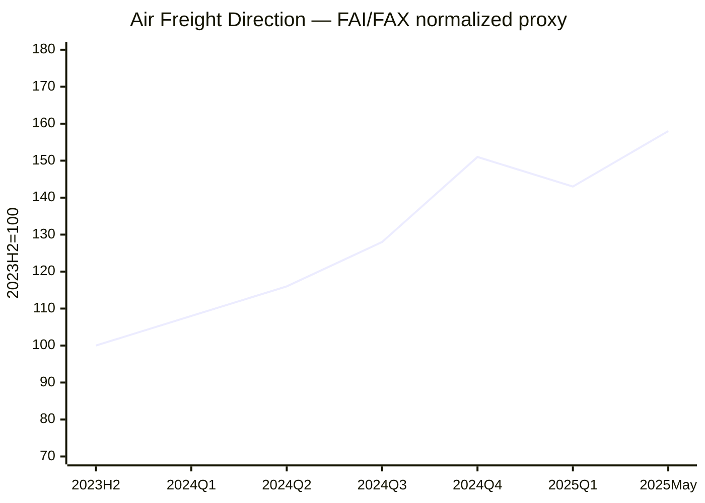

# Global Logistics Market Insights — 2026-W31

**보고일:** 2026-07-29  
**주차 기준:** ISO Week 31  
**데이터 마감:** 2026-07-29, Asia/Seoul  
**작성 원칙:** 최신 공개 데이터 우선. 구독형·부분 공개 지표는 공개 범위만 사용하며, 확인되지 않은 수치는 임의 추정하지 않음.

---

## 1. Executive Summary

2026년 31주차 글로벌 물류시장은 **해상 spot 운임의 완만한 하락, 미국 신규 관세 시행 후 frontloading 약화, Red Sea·중동발 연료 리스크, AI·반도체 중심의 항공화물 수요 강세**로 요약된다.

Drewry World Container Index(WCI)는 2026년 7월 23일 기준 **USD 4,374/40ft, WoW -4%**로 2주 연속 하락했다. Shanghai Shipping Exchange의 최신 확인 가능한 SCFI는 7월 17일 **3,080.31포인트, WoW -3.28%**였다. CCFI는 7월 24일 **1,901.27포인트, WoW -0.5%**로 spot 하락이 장기·계약 운임에도 점차 반영되기 시작했다.

Xeneta의 7월 24일 공개 시장평균 spot rate는 Far East–US West Coast **USD 6,225/FEU(-1% WoW)**, Far East–US East Coast **USD 8,846/FEU(보합)**, Far East–North Europe **USD 5,212/FEU(-1%)**, Far East–Mediterranean **USD 6,510/FEU(-1%)**였다. 전반적인 방향은 하락이지만, 2월 말 대비 여전히 96~234% 높은 수준이다.

미국 6월 컨테이너 수입은 Descartes 기준 **2,400,627 TEU**, 전월 대비 **-1.2%**, 전년 대비 **+8.2%**였다. 상반기 누계는 **-0.3% YoY**로, 최근 강세는 구조적 소비 회복보다는 관세·유류비 전 선반입 성격이 강하다.

항공에서는 IATA 5월 글로벌 CTK가 **+6.0% YoY**, ACTK가 **+1.9%**였고, Xeneta는 6월 글로벌 항공화물 수요가 **+7% YoY**, spot rate가 평균 **USD 3.40/kg, +38% YoY**였다고 밝혔다. AI·반도체 물량이 Asia–North America 수요를 주도하는 반면, 여객 belly capacity가 늘어난 Europe–North America는 상대적으로 약하다.

**핵심 판단:** 해상운임은 하락 국면에 들어갔지만 급락장은 아니다. 항공은 수요 강세와 공급 회복이 동시에 나타나는 고변동성 구간이다. 조달과 견적 모두 **짧은 유효기간, 분할 매입, surcharge 분리**가 필요하다.

---

## 2. Ocean Freight Market Trends

### 2.1 주요 해상운임 지수 업데이트

| 지표 | 데이터 기준일 | Latest value | WoW | YoY | 데이터 성격 |
|---|---:|---:|---:|---:|---|
| SCFI Composite | 2026-07-17 | 3,080.31 pts | -3.28% | 공개 미표시 | 공식 공개, 최신 확인 가능 회차 |
| CCFI Composite | 2026-07-24 | 1,901.27 pts | -0.5% | 공개 미표시 | 공식 공개, 계약운임 성격 |
| Drewry WCI Composite | 2026-07-23 | USD 4,374/40ft | -4% | 공개 미표시 | 공식 공개 |
| Drewry IACI | 2026-07-23 | USD 960/40ft | -2% | 공개 미표시 | 공식 공개 |
| Freightos FBX Global | 2026-07-29 조회 | 최신 global 숫자 무료 공개 제한 | N/A | N/A | public partial |
| Freightos lane update | 2026-06-30 | Asia-USWC +8%, USEC +8%, N. Europe +3%, Med +2% | 주간 | N/A | 공개 weekly update |
| Xeneta FE–USWC | 2026-07-24 | USD 6,225/FEU | -1% | N/A | 공개 market average |
| Xeneta FE–USEC | 2026-07-24 | USD 8,846/FEU | 0% | N/A | 공개 market average |
| Xeneta FE–N. Europe | 2026-07-24 | USD 5,212/FEU | -1% | N/A | 공개 market average |
| Xeneta FE–Mediterranean | 2026-07-24 | USD 6,510/FEU | -1% | N/A | 공개 market average |
| Xeneta XSI Composite | 2026-07-29 조회 | 최신 composite 비공개 | N/A | N/A | 구독형, 수치 미추정 |

#### 지수별 분석

**SCFI / CCFI**  
SCFI는 7월 중순부터 하락 흐름이 뚜렷하다. 반면 CCFI 하락폭은 0.5%에 그쳐 장기·계약 운임이 spot보다 느리게 조정되고 있음을 보여준다. 장거리 fronthaul 약세는 시차를 두고 한국·일본 및 단거리 아시아 노선에도 반영될 가능성이 높다.

**Drewry WCI**  
WCI는 7월 23일 4% 하락했다. Asia–Europe과 Transpacific이 모두 약화됐으며, 7월 초의 GRI·PSS가 시장에 완전히 정착하지 못했다. 다만 중동 리스크와 blank sailing은 하락 속도를 제한한다.

**Freightos FBX**  
최신 global current 숫자의 무료 공개가 제한적이므로 본 보고서는 6월 30일의 공개 lane별 주간 변동을 참고값으로 사용한다. 당시 7월 GRI 기대와 peak-season 선반입으로 상승했지만, 7월 중순 이후 다른 지표는 해당 상승이 지속되지 못했음을 보여준다.

**Xeneta / XSI**  
최신 XSI composite는 구독형이라 수치를 기재하지 않았다. 대신 Xeneta가 공개한 실제 시장평균 spot rate를 사용했다. 7월 24일 기준 Far East 주요 4개 fronthaul은 전주 대비 0~-1%로 약세였고, offered capacity 증가와 cooling demand가 주요 원인이다.

### 2.2 Ocean Freight Demand and Volume Trends

| 지역 / 지표 | 최신값 | MoM | YoY | 해석 |
|---|---:|---:|---:|---|
| U.S. container imports | 2026년 6월 2,400,627 TEU | -1.2% | +8.2% | 계절적 완화 및 frontloading 종료 |
| China-origin U.S. imports | 814,474 TEU | -0.2% | +27.4% | 중국 영향력 유지 |
| U.S. H1 imports | 2026년 상반기 | N/A | -0.3% | 구조적 수요 회복 제한 |
| Top 10 origins | 2026년 6월 | -0.3% | +13.2% | origin mix 변화 |
| Los Angeles transit delay | 2026년 6월 | 거의 2배 | N/A | West Coast 혼잡 |
| East/Gulf Coast delay | 2026년 6월 | 개선 | N/A | 지역별 편차 확대 |

**Americas**  
미국 수입은 6월 전월 대비 감소했고 상반기 누계도 소폭 역성장했다. 따라서 5~6월 Transpacific 강세를 지속 가능한 소비 호황으로 해석하는 것은 잘못이다. 관세 시행과 연료비 조정 전에 물량을 앞당긴 효과가 더 컸다.

**Europe**  
Asia–Europe spot은 하락 중이지만 Red Sea와 에너지 리스크가 운임의 하방을 제한한다. 실제 운항은 Cape route 중심이어서 최근 긴장이 즉시 capacity를 더 줄이지는 않지만, bunker 및 war-risk surcharge의 근거로 사용될 수 있다.

**Asia**  
Intra-Asia IACI는 USD 960/40ft로 2% 하락했다. 장거리 노선보다 역내 시장에서 신규 공급과 수요 둔화가 빠르게 가격에 반영되고 있다. Korea/Vietnam origin은 Shanghai 하락을 1~2주 후행 반영할 가능성이 높다.

### 2.3 Vessel Capacity Supply and Freight Rate Outlook

| 공급 변수 | 현재 상황 | 영향 |
|---|---|---|
| Offered capacity | Xeneta 기준 주요 fronthaul에서 7월 중 지속 증가 | 하락 압력 |
| Blank sailings | Asia–North America 중심 일부 확대 | 급락 방어 |
| Newbuild deliveries | 명목 공급 증가 지속 | 중기 하락 압력 |
| Red Sea / Hormuz | 높은 안보·보험 리스크 | surcharge 지지 |
| Port congestion | LA 악화, East/Gulf 개선 | 지역별 schedule reliability 차별화 |
| Bunker | 중동 긴장에 민감 | BAF 변동성 |

**2~4주 전망**

- **Asia–USWC:** 완만한 추가 하락 가능성이 가장 높다.
- **Asia–USEC:** USWC보다 견조하지만 고점은 통과한 것으로 판단.
- **Asia–North Europe / Mediterranean:** 수요 둔화와 capacity 증가가 하락 요인, 중동 surcharge가 하락폭 제한.
- **Intra-Asia:** 약세 또는 보합.
- **Korea / Vietnam origin:** Shanghai-origin 하락의 후행 반영 가능.

---

## 3. Air Freight Market Trends

### 3.1 항공화물 수요 및 운임 지표

| 지표 | 기준일 | Latest value | WoW / MoM | YoY | 데이터 성격 |
|---|---:|---:|---:|---:|---|
| IATA Global CTK | 2026년 5월 | +6.0% | 월간 | +6.0% | 공식 공개 |
| IATA Global ACTK | 2026년 5월 | +1.9% | 월간 | +1.9% | 공식 공개 |
| IATA Cargo Load Factor | 2026년 5월 | 46.3% | +1.8%p | +1.8%p | 공식 공개 |
| Asia-Pacific CTK | 2026년 5월 | +8.0% | 월간 | +8.0% | 공식 공개 |
| North America CTK | 2026년 5월 | +10.5% | 월간 | +10.5% | 공식 공개 |
| Europe CTK | 2026년 5월 | +6.7% | 월간 | +6.7% | 공식 공개 |
| Middle East CTK | 2026년 5월 | -8.9% | 월간 | -8.9% | 공식 공개 |
| Xeneta global demand | 2026년 6월 | +7% | 월간 | +7% | public partial |
| Xeneta global spot rate | 2026년 6월 | USD 3.40/kg | 성장률 둔화 | +38% | public partial |
| TAC BAI00 | 2026-06-29 | 2,623 | -5.0% WoW | +31.3% | 공식 dashboard |
| Freightos FAX weekly | 2026-06-30 | CN–NA -9%, CN–N.Europe -2%, N.Europe–NA 0% | 주간 | N/A | public partial |

#### 시장 해석

항공 수요는 해상보다 강하다. IATA 5월 CTK는 6% 증가했고, Xeneta는 6월 수요가 7% 증가했다고 밝혔다. 특히 AI·반도체 장비와 부품이 Asia–North America를 주도한다.

반면 운임 상승률은 둔화되고 있다. Xeneta 6월 평균 spot rate는 USD 3.40/kg로 전년 대비 38% 높았지만, 5월의 +41%보다 상승폭이 낮아졌다. Middle East capacity가 복귀하고 여객 belly 공급이 늘어난 영향이다.

노선별로는 Northeast Asia–North America가 AI 수요로 강한 반면, Europe–North America는 여름 여객 스케줄 확대 때문에 2월 말 대비 약 25% 낮아졌다. 즉 항공시장은 “전 구간 강세”가 아니라 수요의 질과 공급 구조에 따라 분화되고 있다.

### 3.2 Air Freight Market Issues and Outlook

- **E-commerce:** 성장 둔화에도 Asia outbound 수요의 하방을 지지한다.
- **AI·반도체:** 2026년 항공화물 성장의 핵심 엔진으로 부상했다.
- **De minimis:** direct parcel 경제성을 약화시키지만 bulk consolidation, bonded fulfillment, customs brokerage 수요를 확대한다.
- **Belly capacity:** Europe–North America를 중심으로 공급 증가와 운임 하락을 유도한다.
- **Middle East:** hub capacity는 일부 회복했으나 장기 rate는 2026년 연간 5~15% 상승할 것으로 Xeneta가 전망한다.
- **Fuel surcharge:** 실제 spot 구매단가와 분리해 검증해야 하며, 단순 유가 연동은 과도한 조정 위험이 있다.

**2~4주 전망**

- **China/Korea–North America:** AI·반도체 수요로 firm.
- **China/Korea–Europe:** 공급 회복으로 완만한 조정 가능.
- **Europe–North America:** belly capacity 증가로 약세.
- **Middle East-linked:** 높은 운영 리스크와 가격 변동성 지속.

---

## 4. Policy and Macroeconomic Issues

### 4.1 Trump 2.0 Tariff Policies and Trade Disputes

미국은 2026년 7월 24일 EU와 중국을 포함한 60개 교역상대국에 10% 또는 12.5%의 신규 관세를 부과했다. 이 관세는 기존 긴급권 기반 관세가 대법원에서 무효화된 뒤 Section 301을 활용해 재구축된 제도다. 대상은 미국 수입의 99.4%를 포괄하지만 원유·가스·비료·핵심광물 등 다수 품목은 제외됐다.

이제 문제는 “관세가 시행될까”가 아니라 “적용 방식과 비용 전가가 어떻게 나타날까”다. 5~6월 화주들은 관세 시행 전에 물량을 앞당겼고, 이는 Transpacific 운임 급등을 만들었다. 관세가 발효된 뒤에는 해당 선반입 수요가 약해져 8월 물동량 공백이 발생할 가능성이 높다.

기업 대응은 세 방향으로 진행된다. 첫째, HS code 및 exclusion list를 다시 검토한다. 둘째, China+1 sourcing을 확대하되 실제 원산지 규정과 생산공정 기준을 확인한다. 셋째, bonded warehouse와 FTZ를 활용해 duty 납부 시점을 늦춘다.

Forwarder가 단순히 “관세는 화주 부담”이라고 말하는 것은 무책임하다. 실제 영업가치는 선적일, 도착일, 통관일별 landed-cost scenario를 제공하고, in-transit exemption과 원산지 증빙을 점검하는 데 있다.

### 4.2 De Minimis와 E-commerce

미국과 EU의 de minimis 규제 강화는 저가 parcel direct injection 모델을 약화시킨다. 그러나 물량이 완전히 사라지는 것은 아니다. 대량 consolidation, 일반 항공화물, bonded warehouse, 현지 fulfillment로 이동한다.

따라서 항공화물 시장에서 e-commerce 둔화를 단순 수요 감소로만 보면 안 된다. Express parcel은 압박을 받지만, customs brokerage, inventory positioning, last-mile를 결합한 3PL에는 오히려 기회다.

### 4.3 Red Sea·Hormuz·Energy Risk

중동 긴장은 7월 말에도 높은 수준이다. 유가는 다시 상승했고, Bab el-Mandeb와 Hormuz의 위험은 보험료와 surcharge에 반영되고 있다. 다만 대부분의 대형 container service는 이미 Cape route를 사용하고 있어 최근 긴장이 물리적 capacity를 즉시 더 줄이는 효과는 제한적이다.

핵심은 운영 변화보다 가격 논리다. 선사는 bunker cost와 conflict risk를 근거로 surcharge를 유지하려 할 것이다. 그러나 Xeneta가 지적했듯 시장 fundamentals는 rising capacity와 cooling demand다. 지정학은 하락 속도를 늦출 수는 있어도, 수급 방향을 완전히 뒤집기는 어렵다.

### 4.4 Fed, ECB, China and Global Outlook

미국 FOMC는 7월 28~29일 회의 중이며, 보고서 마감 시점에는 결정이 발표되지 않았다. 현재 연방기금금리 목표범위는 **3.50~3.75%**다. 신규 관세와 에너지 가격은 인플레이션 상방 요인이지만, 수요 둔화는 반대 방향으로 작용한다. 최종 결정은 발표 후 별도 업데이트가 필요하다.

ECB는 7월 23일 예금금리 **2.25%**, 주요재융자금리 **2.40%**, 한계대출금리 **2.65%**를 동결했다. ECB는 중동 에너지 충격의 2차 효과가 아직 완전히 나타나지 않았다고 평가했다.

중국 2분기 GDP는 **YoY +4.3%**, 상반기는 **+4.7%**였다. 제조업은 견조하지만 건설과 부동산은 약하다. 이는 수출 공급은 충분하지만 내수 흡수력이 부족한 구조다.

IMF는 2026년 세계경제 성장률을 **3.0%**, 2027년을 **3.4%**로 전망했고, 2026년 글로벌 headline inflation 전망을 **4.7%**로 상향했다. 기술투자, 특히 AI가 성장을 지지하는 반면 전쟁과 에너지 충격이 인플레이션을 높이는 상반된 구조다.

**거시 시사점:** 하반기 물류시장은 경기호황보다 정책·기술투자·에너지 리스크의 조합에 의해 움직인다. 해상은 완만한 하락, 항공은 AI 중심의 선택적 강세가 기본 시나리오다.

---

## 5. Comprehensive Impact on Logistics Sectors

| 부문 | 시장 영향 | 주요 리스크 | 권고 대응 |
|---|---|---|---|
| Ocean FCL | spot 하락 지속 | 장기 고가 매입 | 2~3주 분할 매입 |
| Ocean LCL | FCL 하락 후행 | buy/sell mismatch | 주간 원가 갱신 |
| Air Freight | AI lane 강세, transatlantic 약세 | lane별 편차 | direct/deferred 분리 |
| Customs | 신규 관세 즉시 적용 | 추징·hold | HS/exclusion/COO 검토 |
| Warehousing | frontloading 재고 누적 | 보관비·금융비 | bonded/FTZ 활용 |
| Inland | LA delay 확대 | D&D | 항만별 delivery plan |
| Sales | 고객의 방향성 혼란 | rate-only 영업 | market note형 견적 |
| Risk | 중동·보험·fuel | ETA·surcharge | routing/war-risk clause |

---

## 6. Conclusion / Recommendations

### 결론

2026년 31주차는 **해상 spot 운임의 완만한 하락과 항공화물의 선택적 강세가 동시에 나타나는 분화 국면**이다. 해상은 capacity 증가와 frontloading 종료가 가격을 끌어내리고 있다. 항공은 AI·반도체가 Asia–North America를 지지하지만 belly capacity가 많은 노선은 약하다.

### 권고사항

1. 미국향 FCL은 **2~3주 단위 분할 매입**을 우선한다.
2. Quote validity는 **3~5일**로 유지한다.
3. Base freight, GRI, PSS, BAF, war-risk surcharge를 분리한다.
4. 8월 미국향 물량 공백과 선사의 blank sailing 대응을 동시에 모니터링한다.
5. 신규 관세 대상은 HS code, exclusion list, COO, in-transit 조건을 사전 검토한다.
6. 항공은 AI·반도체 cargo와 일반 e-commerce cargo를 구분해 pricing한다.
7. Europe–North America 항공은 belly capacity 증가를 활용해 재협상한다.
8. 고객에게 단순 rate sheet가 아니라 **운임 방향·관세·연료·booking timing을 설명하는 market note**를 제공한다.

---

## 7. Historical Rate Direction Charts

> 아래 그래프는 2023년 하반기~2025년 5월의 공개 FBX·FAI 보도 흐름을 2023H2=100으로 정규화한 **방향성 참고치**다. 원시 유료 시계열이 아니며 계약·정산용으로 사용하면 안 된다.

---

## 8. Sources

1. Shanghai Shipping Exchange, SCFI / CCFI, latest public data.  
   https://en.sse.net.cn/eninfo/MarketReport/index.shtml  
   https://www.sse.net.cn/index/singleIndex?indexType=ccfi
2. Drewry, World Container Index, 23 July 2026.  
   https://www.drewry.co.uk/trackers-and-indices/latest-trackers-and-indices/world-container-index-assessed-by-drewry
3. Freightos, Ocean and Air Weekly Update, 30 June 2026.  
   https://www.freightos.com/freight-resources/ocean-rates-steady-as-shippers-brace-for-july-hikes-june-30-2026-update/
4. Xeneta, Weekly Ocean Container Shipping Market Update, 24 July 2026.  
   https://www.xeneta.com/news/xeneta-weekly-ocean-container-shipping-market-update-24.7.2026
5. Descartes, July Global Shipping Report, 8 July 2026.  
   https://www.descartes.com/resources/knowledge-center/descartes-releases-july-global-shipping-report-june-us-containerized-imports-remain-stable
6. IATA, Air Cargo Demand Up 6.0% in May, 29 June 2026.  
   https://www.iata.org/en/pressroom/2026-releases/06-29-air-cargo-demand-up-may/
7. TAC Index, Air Freight Market Dashboard, 29 June 2026.  
   https://dashboard.tacindex.com/
8. Xeneta, Global Air Cargo Demand +7% in June, 3 July 2026.  
   https://www.xeneta.com/news/soaring-ai-shipments-invigorate-air-cargos-resilience-as-global-demand-rises-7-in-june-but-spot-rate-growth-continues-to-ease
9. Xeneta, 2026 Air Freight Outlook Update, 17 July 2026.  
   https://www.xeneta.com/news/xeneta-publishes-2026-air-freight-outlook-update-long-term-rates-set-to-rise-5-15-full-year-due-to-impact-of-middle-east-conflict
10. Reuters, U.S. tariffs on 60 trading partners, 24 July 2026.  
    https://www.reuters.com/world/us/trump-imposes-forced-labor-duties-60-trading-partners-as-10-us-tariffs-expire-2026-07-24/
11. ECB, Monetary Policy Decisions, 23 July 2026.  
    https://www.ecb.europa.eu/press/pr/date/2026/html/ecb.mp260723~29f24d99bc.en.html
12. National Bureau of Statistics of China, Q2/H1 GDP, 17 July 2026.  
    https://www.stats.gov.cn/english/PressRelease/202607/t20260717_1964160.html
13. IMF, World Economic Outlook Update, July 2026.  
    https://www.imf.org/en/publications/weo/issues/2026/07/08/world-economic-outlook-update-july-2026
14. Federal Reserve, July 2026 calendar.  
    https://www.federalreserve.gov/newsevents/2026-july.htm
