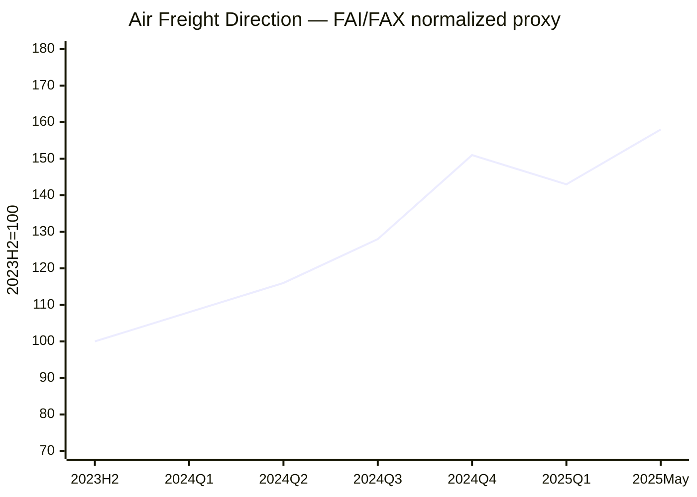

# Global Logistics Market Weekly Report – August 5, 2026 Week

**보고일:** 2026-08-05  
**주차 기준:** ISO Week 32  
**데이터 마감:** 2026-08-05, Asia/Seoul  
**작성 원칙:** 최신 공개 데이터 우선. 유료·부분 공개 지표는 공개 범위만 사용하며, 확인되지 않은 수치는 임의 추정하지 않았다.

---

## 1. Executive Summary

2026년 32주차 글로벌 물류시장은 **Shanghai-origin spot 운임의 단기 반등과 글로벌 East–West 운임의 하락 지속**, **미국 관세 시행 이후 Transpacific frontloading 약화**, **Hormuz 재개 협상 기대와 Red Sea 공격 위험의 공존**, **항공화물의 높은 전년 대비 운임 수준**으로 요약된다.

SCFI는 최신 공개 확인값인 2026년 7월 24일 기준 **3,062.95포인트**, 전주 3,080.31 대비 **-0.56% WoW**였다. 7월 31일 회차는 공식 원자료의 검색 검증이 불완전해 본 보고서의 공식 표에는 7월 24일 값을 사용했다. Drewry WCI는 7월 30일 기준 **USD 4,255/40ft, WoW -3%**로 하락했다. Freightos의 최신 공개 주간 자료에서는 Asia–US West Coast **-6%**, Asia–US East Coast **보합**, Asia–North Europe **-2%**, Asia–Mediterranean **-4%**였다. Xeneta의 최신 공개 시장평균은 7월 24일 기준 Far East–US West Coast **USD 6,225/FEU(-1%)**, Far East–US East Coast **USD 8,846/FEU(보합)**, Far East–North Europe **USD 5,212/FEU(-1%)**, Far East–Mediterranean **USD 6,510/FEU(-1%)**였다.[1][2][3][4]

미국 6월 컨테이너 수입은 Descartes 기준 **2,400,627 TEU**, 전월 대비 **-1.2%**, 전년 대비 **+8.2%**였다. 중국발은 **814,474 TEU**, 전월 대비 **-0.2%**, 전년 대비 **+27.4%**였다. 다만 2026년 상반기 누계는 **-0.3% YoY**로, 5~6월의 강세는 구조적 소비 호황보다 관세와 연료비 상승 전 선반입의 성격이 강했다.[5]

항공화물은 최신 완전 공개 IATA 월간 자료인 2026년 5월 기준 글로벌 CTK **+6.0% YoY**, ACTK **+1.9%**, cargo load factor **46.3%(+1.8%p)**였다. TAC의 글로벌 BAI00은 6월 29일 기준 전주 대비 **-5.0%**, 전년 대비 **+31.3%**였다. Freightos Air Index의 최신 공개 주간 자료에서는 China–North America **-13%**, China–North Europe **-1%**, North Europe–North America **보합**이었다.[6][7][3]

정책과 지정학 측면에서는 미국의 신규 10~12.5% 관세가 이미 시행된 이후라 선반입 수요가 약해질 가능성이 높다. 동시에 미국·이란 간 Hormuz 재개 협상 진전 기대가 유가를 일부 낮췄지만, Red Sea와 Oman 인근 선박 공격이 계속돼 실제 운항·보험 리스크는 제거되지 않았다. Goldman Sachs는 명확한 합의 또는 대규모 확전 전까지 Brent가 **USD 80~90/bbl** 범위에 머물 가능성을 제시했다.[8][9]

**핵심 판단:** 해상운임은 추세적으로 하락하고 있으나 선사들의 blank sailing과 지정학 surcharge가 급락을 방어하고 있다. 항공운임은 주간 조정에도 전년 대비 높은 수준이다. 지금은 장기 고정매입보다 **2~3주 단위 분할 매입, 3~5일 견적 유효기간, base rate와 surcharge의 분리**가 합리적이다.

---

## 2. Ocean Freight Market Trends

### 2.1 주요 해상운임 지수 업데이트

| 지표 | 데이터 기준일 | Latest value | WoW | YoY | 데이터 성격 |
|---|---:|---:|---:|---:|---|
| SCFI Composite | 2026-07-24 | 3,062.95 pts | **-0.56%** | 공개 미표시 | 공식 공개 |
| Drewry WCI Composite | 2026-07-30 | USD 4,255/40ft | **-3%** | 공개 미표시 | 공식 공개 |
| Drewry IACI | 2026-07-30 | USD 956/40ft | **0%** | 공개 미표시 | 공식 공개 |
| FBX Asia–US West Coast | 2026-07-22 update | 절대값 무료 비공개 | **-6%** | N/A | public partial |
| FBX Asia–US East Coast | 2026-07-22 update | 절대값 무료 비공개 | **0%** | N/A | public partial |
| FBX Asia–North Europe | 2026-07-22 update | 절대값 무료 비공개 | **-2%** | N/A | public partial |
| FBX Asia–Mediterranean | 2026-07-22 update | 절대값 무료 비공개 | **-4%** | N/A | public partial |
| Xeneta FE–USWC | 2026-07-24 | USD 6,225/FEU | **-1%** | N/A | 공개 market average |
| Xeneta FE–USEC | 2026-07-24 | USD 8,846/FEU | **0%** | N/A | 공개 market average |
| Xeneta FE–North Europe | 2026-07-24 | USD 5,212/FEU | **-1%** | N/A | 공개 market average |
| Xeneta FE–Mediterranean | 2026-07-24 | USD 6,510/FEU | **-1%** | N/A | 공개 market average |
| Xeneta XSI Composite | 2026-08-05 조회 | 최신 composite 비공개 | N/A | N/A | 구독형, 수치 미추정 |

#### 지수별 분석

**SCFI**  
7월 24일 SCFI는 3,062.95로 전주 대비 17.36포인트 하락했다. 계산상 주간 하락률은 0.56%다. SCFI는 Shanghai-origin spot rate와 해상 관련 surcharge를 포함하므로 선사의 단기 GRI·PSS·WRS 시도에 민감하다. 최신 7월 31일 회차가 일부 2차 자료에서 언급되지만, 공식 원자료의 검색 검증이 불완전해 본 보고서에는 포함하지 않았다.[1]

**Drewry WCI**  
WCI는 7월 30일 USD 4,255/40ft로 3% 하락했다. 주요 East–West 항로에서 수요가 약해지고 offered capacity가 늘어난 결과다. 다만 Drewry의 취소항차 전망은 선사들이 공급관리를 통해 하락 속도를 조절하고 있음을 보여준다.[2]

**Freightos FBX**  
Freightos의 7월 22일 공개 업데이트는 USWC와 유럽·지중해 노선의 하락을 확인한다. 특히 Asia–USWC -6%는 미국 관세 전 rush가 이미 정점을 통과했음을 보여준다. 최신 absolute FBX composite는 무료 공개가 제한돼 수치를 추정하지 않았다.[3]

**Xeneta / XSI**  
Xeneta의 공개 market average는 모든 주요 Far East fronthaul에서 0~-1% 하락했다. 2월 말 대비로는 여전히 96~234% 높은 수준이지만, 방향은 명확히 완화 쪽이다. XSI composite는 구독형이라 최신 수치를 기재하지 않았다.[4]

### 2.2 Ocean Freight Demand and Volume Trends

| 지역 / 지표 | 최신값 | MoM | YoY | 해석 |
|---|---:|---:|---:|---|
| U.S. container imports | 2026년 6월 2,400,627 TEU | -1.2% | +8.2% | 선반입 후 안정화 |
| China-origin U.S. imports | 814,474 TEU | -0.2% | +27.4% | 중국 영향력 유지 |
| U.S. H1 imports | 2026년 상반기 | N/A | -0.3% | 구조적 수요 회복 제한 |
| Top 10 origin imports | 2026년 6월 | -0.3% | +13.2% | origin mix 변화 |
| Asia–Europe spot | 7월 말 | 하락 | N/A | capacity 증가와 수요 둔화 |
| Global port throughput | 2026년 5월 | +1.5% | +2.0% | 완만한 성장 |

**Americas**  
미국 수입은 전년 대비 높지만 상반기 누계는 소폭 감소했다. 이는 최근 Transpacific 운임 급등이 구조적 소비 회복이 아니라 tariff timing에 의해 왜곡됐음을 의미한다. 7월 관세 시행 이후 8월 물량은 약해질 가능성이 높다.

**Europe**  
Asia–Europe은 offered capacity 증가와 early peak-season 종료로 하락 압력이 우세하다. 다만 Red Sea와 Hormuz 불확실성으로 bunker, war-risk insurance, Cape routing 비용이 유지돼 all-in 비용의 하락 속도는 base rate보다 느릴 가능성이 높다.

**Asia**  
Intra-Asia IACI는 USD 956/40ft로 보합이었다. 역내 노선은 장거리 fronthaul보다 신규 선복 공급을 빠르게 반영하고 있다. 한국·베트남 출발 운임은 Shanghai 하락을 1~2주 후행해 반영할 가능성이 높다.

### 2.3 Vessel Capacity Supply and Freight Rate Outlook

| 공급 변수 | 최신 상황 | 시장 영향 |
|---|---|---|
| East–West blank sailings | 8월 초~9월 초 예정 723항차 중 58항차 취소 전망 | 약 8% 공급 축소, 하락 방어 |
| Offered capacity | 주요 Far East fronthaul 증가 | 운임 하락 압력 |
| Newbuild deliveries | 명목 선복 증가 지속 | 중기 하락 압력 |
| Hormuz | 재개 협상 진전 기대, 최종 합의 없음 | fuel·insurance 변동성 |
| Red Sea | 선박 공격 지속 | Cape routing·war-risk 유지 |
| Port congestion | 항만별 편차 지속 | schedule reliability 차별화 |

#### 2~4주 전망

- **Asia–USWC:** 추가 하락 가능성이 가장 높다. Blank sailing이 하락폭을 제한한다.
- **Asia–USEC:** USWC보다 견조하지만 고점은 통과했다.
- **Asia–North Europe / Mediterranean:** capacity 증가로 약세, 지정학 surcharge가 all-in 비용 하락을 제한한다.
- **Intra-Asia:** 보합 또는 약세.
- **Korea / Vietnam origin:** Shanghai 및 주요 fronthaul의 약세를 후행 반영할 가능성이 높다.

---

## 3. Air Freight Market Trends

### 3.1 항공화물 수요 및 운임 업데이트

| 지표 / 노선 | 데이터 기준일 | Latest value | WoW / MoM | YoY | 데이터 성격 |
|---|---:|---:|---:|---:|---|
| IATA Global CTK | 2026년 5월 | +6.0% | 월간 | +6.0% | 공식 공개 |
| IATA Global ACTK | 2026년 5월 | +1.9% | 월간 | +1.9% | 공식 공개 |
| IATA Cargo Load Factor | 2026년 5월 | 46.3% | +1.8%p | +1.8%p | 공식 공개 |
| Asia-Pacific CTK | 2026년 5월 | +8.0% | 월간 | +8.0% | 공식 공개 |
| North America CTK | 2026년 5월 | +10.5% | 월간 | +10.5% | 공식 공개 |
| Europe CTK | 2026년 5월 | +6.7% | 월간 | +6.7% | 공식 공개 |
| Middle East CTK | 2026년 5월 | -8.9% | 월간 | -8.9% | 공식 공개 |
| TAC BAI00 | 2026-06-29 | 공개 변화율 | **-5.0%** | **+31.3%** | TAC public article |
| FAX China–North America | 2026-07-22 update | 절대값 무료 비공개 | **-13%** | N/A | public partial |
| FAX China–North Europe | 2026-07-22 update | 절대값 무료 비공개 | **-1%** | N/A | public partial |
| FAX North Europe–North America | 2026-07-22 update | 절대값 무료 비공개 | **0%** | N/A | public partial |

#### 시장 해석

IATA 데이터는 수요가 공급보다 빠르게 증가했음을 보여준다. 특히 Asia–North America는 5월 **+19.9% YoY**, Europe–Asia는 **+10.0%**로 강했다. 반면 Europe–Middle East는 **-19.8%**로 Gulf-linked corridor의 운영 차질이 지속됐다.[6]

Freightos 주간 자료에서 China–North America가 13% 하락한 것은 Prime Day 및 긴급 선적 이후의 단기 정상화다. TAC BAI00은 주간 하락에도 전년 대비 31.3% 높아, 항공운임이 저운임 국면으로 돌아간 것은 아니다.[7][3]

### 3.2 Air Freight Market Issues and Outlook

- **AI·반도체:** Asia–North America 수요의 핵심 지지 요인이다.
- **E-commerce:** 성장률은 둔화됐지만 Asia outbound 수요의 바닥을 지지한다.
- **De minimis:** direct parcel 경제성을 낮추는 대신 consolidation, bonded fulfillment, customs brokerage 수요를 확대한다.
- **Belly capacity:** Europe–North America와 일부 장거리 노선의 하락 요인이다.
- **Middle East:** Hormuz 협상 기대에도 실제 선박·항공 안전 리스크가 남아 fuel surcharge와 routing premium을 유지시킨다.
- **Sea-to-air conversion:** Red Sea 지연이나 항만 병목이 확대될 경우 긴급화물이 항공으로 전환될 수 있다.

#### 2~4주 전망

- **China/Korea–North America:** 단기 조정 후 AI·반도체 수요로 firm.
- **China/Korea–Europe:** capacity 회복으로 완만한 약세.
- **Europe–North America:** belly capacity 증가로 약세 또는 보합.
- **Middle East-linked lanes:** 가장 높은 운항·보험·연료 리스크.

---

## 4. Policy and Macroeconomic Issues

### 4.1 Trump 2.0 Tariff Policies and Trade Disputes

미국은 7월 24일부터 60개 교역상대국을 대상으로 10% 또는 12.5%의 신규 관세를 시행했다. 이 조치는 기존 긴급권 기반 관세가 법적 제약을 받은 뒤 Section 301을 활용해 재구축된 체계다. 대상 범위는 광범위하지만 원유·가스·비료·일부 핵심 품목에는 예외가 있다.

물류시장에 가장 중요한 변화는 관세율보다 **수요의 시간 이동**이다. 화주들은 관세 발효 전에 5~6월 물량을 앞당겼고, 이에 따라 미국 수입과 Transpacific spot rate가 급등했다. 이제 관세가 시행된 만큼 8월 이후에는 선반입 반작용으로 물량 공백이 나타날 수 있다.

기업의 대응은 단순한 China+1보다 복잡하다. 최종 선적국을 바꾸더라도 생산공정이 충분히 변경되지 않으면 원산지 판정이 바뀌지 않는다. 따라서 공급망 재편에는 생산설비, 원재료, 가공공정, HS code와 증빙체계가 모두 포함돼야 한다.

Forwarder의 실무 과제는 다음과 같다.

1. HS code와 관세 예외 목록 사전 검토
2. 원산지 및 forced-labor 관련 공급망 증빙 확보
3. bonded warehouse·FTZ를 활용한 duty 납부 시점 관리
4. 견적서에 tariff-change, customs hold, storage 비용 책임 명시
5. 선적일·도착일·통관일별 landed-cost scenario 제시

단순히 “관세는 화주 부담”이라고 적는 것은 영업적 가치가 없다. 고객에게 비용 발생 시점과 대응 선택지를 제시해야 한다.

### 4.2 De Minimis와 E-commerce 구조 변화

미국과 EU의 de minimis 규제 강화는 low-value parcel의 direct injection 모델을 약화시킨다. 그러나 물량이 사라지는 것이 아니라 bulk consolidation, 일반 항공화물, bonded warehouse, 현지 fulfillment로 이동할 가능성이 높다.

따라서 e-commerce 규제는 express parcel 사업자에는 악재지만, 통관·창고·라스트마일을 결합할 수 있는 3PL에는 기회다. 화주는 항공운임만 비교할 것이 아니라 duty, brokerage, inventory holding, return handling, last-mile를 포함한 total landed cost를 봐야 한다.

### 4.3 Hormuz·Red Sea·에너지 리스크

8월 4일 미국·카타르 측은 이란과의 휴전 및 Hormuz 재개 협상에 진전이 있다고 밝혔다. 이에 따라 유가는 일시적으로 하락했다. 그러나 최종 합의는 없고, Oman 인근 화물선 피격과 Red Sea의 Houthi 공격이 계속되고 있다.[8][9]

Goldman Sachs는 확정적인 합의나 대규모 확전 전까지 Brent가 USD 80~90/bbl 범위에 머물 것으로 전망했다. 이는 물류비가 단기간에 정상화되지 않을 가능성을 의미한다.

지정학 리스크는 실제 통항이 중단되기 전에 다음 비용에 반영된다.

- bunker 및 jet fuel 상승
- war-risk insurance 인상
- Cape of Good Hope 우회 유지
- 선박·항공기 routing 제약
- safety stock 및 inventory holding 기간 증가
- BAF, emergency fuel surcharge, war-risk surcharge 분쟁

해상 base freight가 내려가도 total landed cost가 같은 속도로 내려간다고 가정하면 안 된다.

### 4.4 Fed, ECB, 중국 경제와 성장 전망

미 연준의 최신 공식 확인 가능한 정책금리 범위는 **3.50~3.75%**다. 7월 Monetary Policy Report는 에너지 등 공급 충격으로 인플레이션이 2% 목표를 상회하고 있으며, 경제활동은 불확실성 속에서도 견조하다고 평가했다.[10]

ECB는 7월 23일 예금금리 **2.25%**, 주요재융자금리 **2.40%**, 한계대출금리 **2.65%**를 동결했다. 에너지 충격의 2차 효과가 아직 완전히 반영되지 않았기 때문에 데이터 의존적 접근을 유지했다.[11]

중국의 6월 제조업 PMI는 **50.3**으로 확장 영역에 복귀했으나, 신규 수출주문지수는 **50.1**, 중소기업 PMI는 50 이하에 머물렀다. 생산 회복은 확인되지만 내수와 기업 규모별 격차가 크다.[12]

**거시 시사점:** 높은 금리는 재고금융 비용을 유지하고, 중국의 수출 생산능력은 글로벌 공급경쟁을 심화시킨다. 해상은 중기 하락 압력이 우세하고, 항공은 AI·반도체 등 고부가가치 수요가 특정 노선을 지지하는 분화 시장이 예상된다.

---

## 5. Comprehensive Impact on Logistics Sectors

| 부문 | 시장 영향 | 주요 리스크 | 권고 대응 |
|---|---|---|---|
| Ocean FCL | 종합지수 하락 지속 | 고점 장기매입 | 2~3주 분할 매입 |
| Ocean LCL | FCL 하락 후행 반영 | buy/sell mismatch | 주간 원가 갱신 |
| Air Freight | Asia outbound 고점 조정 | lane별 가격 편차 | direct/deferred 분리 |
| Customs | 신규 관세 적용 | 추징·hold | HS/exclusion/COO 검토 |
| Warehousing | 선반입 재고 누적 | 보관비·금융비 | bonded/FTZ 활용 |
| Inland | 항만별 혼잡 편차 | D&D 증가 | port별 delivery plan |
| Sales | 지수 방향 혼조 | rate-only 영업 | 근거 포함 market note |
| Risk | Hormuz·Red Sea | ETA·보험·fuel | routing/war-risk clause |

---

## 6. Conclusion / Recommendations

### 결론

2026년 32주차 시장은 **해상운임의 추세적 하락과 지정학·공급관리의 하락 방어가 충돌하는 구간**이다. 미국 관세 시행 이후 Transpacific 수요는 약화될 가능성이 높고, offered capacity 증가는 가격 하락 요인이다. 반면 blank sailing, bunker, war-risk insurance는 all-in 비용의 급락을 막는다.

항공은 주간 조정에도 전년 대비 높은 운임을 유지하고 있다. AI·반도체 수요와 Gulf-linked capacity risk가 핵심 변수다.

### 권고사항

1. 미국향 FCL은 **2~3주 단위 분할 매입**을 우선한다.
2. Quote validity는 **3~5일**로 유지한다.
3. Base freight, GRI, PSS, BAF, war-risk surcharge를 분리한다.
4. 8월 미국향 수요 공백과 blank sailing 효과를 동시에 모니터링한다.
5. 관세 대상 화물은 HS code, exclusion, COO, forced-labor evidence를 사전 검토한다.
6. Hormuz 협상 뉴스만 보고 즉시 routing 정상화를 가정하지 않는다.
7. 항공은 AI·반도체 cargo와 일반 e-commerce cargo를 분리해 pricing한다.
8. 고객에게 단순 rate sheet가 아니라 **운임 방향·관세·연료·booking timing을 설명하는 market note**를 제공한다.

---

## 7. Historical Rate Direction Charts

> 아래 차트는 2023년 하반기~2025년 5월의 공개 FBX·FAI/FAX 보도 흐름을 2023H2=100으로 정규화한 방향성 참고치다. 원시 유료 시계열이 아니며 계약·정산용으로 사용할 수 없다.

---

## 8. Sources

1. Shanghai Shipping Exchange Institute, SCFI, latest officially indexed data dated 2026-07-24.  
   https://www.sse.net.cn/index/singleIndex?indexType=scfi
2. Drewry, World Container Index / Trackers and Indices, data dated 2026-07-30.  
   https://www.drewry.co.uk/trackers-and-indices/latest-trackers-and-indices
3. Freightos, *Ocean rates ease on early peak season cooling and capacity additions*, 2026-07-22.  
   https://www.freightos.com/freight-resources/ocean-rates-ease-on-early-peak-season-cooling-and-capacity-additions-july-22-2026-update/
4. Xeneta, *Weekly Ocean Container Shipping Market Update*, 2026-07-24.  
   https://www.xeneta.com/news/xeneta-weekly-ocean-container-shipping-market-update-24.7.2026
5. Descartes, *July Global Shipping Report*, 2026-07-08.  
   https://www.descartes.com/resources/knowledge-center/descartes-releases-july-global-shipping-report-june-us-containerized-imports-remain-stable
6. IATA, *Air Cargo Demand Up 6.0% in May*, 2026-06-29.  
   https://www.iata.org/en/pressroom/2026-releases/06-29-air-cargo-demand-up-may/
7. TAC Index, *Gulf ceasefire eases pressure on jet fuel, but air freight rates stay firm through June*, 2026-07-03.  
   https://www.tacindex.com/blog/air-freight-rates-costs-latest-july-2026/
8. Reuters, *Goldman sees Brent at USD 80–90 until US-Iran deal or major escalation*, 2026-08-04.
9. Associated Press / Reuters reporting on Hormuz reopening talks and continuing commercial vessel attacks, 2026-08-04.
10. Federal Reserve, *Monetary Policy Report – July 2026*.  
    https://www.federalreserve.gov/monetarypolicy/2026-07-mpr-summary.htm
11. European Central Bank, *Monetary Policy Decisions*, 2026-07-23.  
    https://www.ecb.europa.eu/press/pr/date/2026/html/ecb.mp260723~29f24d99bc.en.html
12. National Bureau of Statistics of China, *Purchasing Managers’ Index for June 2026*.  
    https://www.stats.gov.cn/english/PressRelease/202607/t20260701_1964047.html
