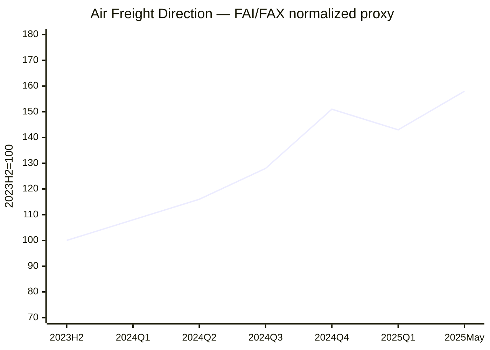

# Global Logistics Market Insights — 2026-W33

**보고일:** 2026-08-12  
**주차 기준:** ISO Week 33  
**데이터 마감:** 2026-08-12 15:31, Asia/Seoul  
**작성 원칙:** 공개 확인 가능한 최신 데이터를 우선 사용했다. 구독형 또는 부분 공개 지표는 공개 범위만 사용했으며, 확인되지 않은 값은 임의 추정하지 않았다.

---

## 1. Executive Summary

2026년 33주차 글로벌 물류시장은 **Transpacific spot rate 재상승, Asia–Europe 약세, 미국 수입 frontloading의 후반부, Hormuz 정상화 기대 후퇴, 항공화물 spot 반등**이 동시에 나타나는 분화 국면이다.

Shanghai Shipping Exchange의 SCFI는 2026년 8월 7일 **3,276.14포인트**, 전주 3,205.97 대비 **+2.19% WoW**로 상승했다. Drewry World Container Index(WCI)는 8월 6일 **USD 4,297/40ft, +1% WoW**로 3주 연속 하락 후 반등했다. Transpacific에서는 Shanghai–New York **USD 7,893/40ft(+4%)**, Shanghai–Los Angeles **USD 5,894/40ft(+3%)**로 GRI와 중국 항만 혼잡이 가격을 지지했다. 반면 Shanghai–Genoa는 **USD 5,506/40ft(-2%)**, Shanghai–Rotterdam은 **USD 4,653/40ft(보합)**이었다.

Freightos는 8월 11일 주간 업데이트에서 Asia–US West Coast **+11%**, Asia–US East Coast **+1%**, Asia–North Europe **-8%**, Asia–Mediterranean **-7%**를 제시했다. Freightos Baltic Index(FBX) global current value는 8월 12일 조회 기준 **USD 3,607/40ft**다. Xeneta 역시 8월 6일 Far East–USWC **USD 6,824/FEU(+13.8% WoW)**, Far East–USEC **USD 9,988/FEU(+12.8%)**로 미국향 급등을 확인한 반면 Far East–North Europe과 Mediterranean은 각각 **-4.9%, -4.8%** 하락했다.

미국 수입의 최신 완전 공개 월간 실적은 Descartes의 6월 데이터다. 총 **2,400,627 TEU, MoM -1.2%, YoY +8.2%**였고 중국발은 **814,474 TEU, MoM -0.2%, YoY +27.4%**였다. 상반기 누계는 **YoY -0.3%**로, 최근 운임 급등을 구조적 소비 호황으로 해석하기 어렵다.

항공화물은 IATA 6월 CTK가 **+8.5% YoY**, ACTK가 **+4.4%**, load factor가 **46.9%(+1.7%p)**였다. TAC Baltic Air Freight Index(BAI00)는 8월 3일 **2,424**, **+1.3% WoW, +19.6% YoY**였다. Freightos Air Index는 8월 11일 China–North America **+6% WoW, 약 USD 6.00/kg**, China–Europe **+2%, USD 4.11/kg**, North Europe–North America **+4%**를 기록했다.

**핵심 판단:** 지금은 “해상운임 전체가 다시 오른다”가 아니다. **미국향은 재상승, 유럽향은 하락**이다. 항공도 Gulf·연료 리스크와 AI/전자제품 수요 때문에 Asia outbound가 다시 단단해지고 있다. 따라서 동일한 구매·판매 전략을 전 노선에 적용하면 손실 가능성이 커진다.

---

## 2. Ocean Freight Market Trends

### 2.1 주요 해상운임 지수 업데이트

| 지표 | 데이터 기준일 | Latest value | WoW | YoY | 데이터 성격 |
|---|---:|---:|---:|---:|---|
| SCFI Composite | 2026-08-07 | **3,276.14 pts** | **+2.19%** | 공개 미표시 | Shanghai Shipping Exchange 공식 |
| Drewry WCI Composite | 2026-08-06 | **USD 4,297/40ft** | **+1%** | 공개 미표시 | 공식 공개 |
| WCI Shanghai–Los Angeles | 2026-08-06 | USD 5,894/40ft | +3% | 미표시 | 공식 공개 |
| WCI Shanghai–New York | 2026-08-06 | USD 7,893/40ft | +4% | 미표시 | 공식 공개 |
| WCI Shanghai–Rotterdam | 2026-08-06 | USD 4,653/40ft | 0% | 미표시 | 공식 공개 |
| WCI Shanghai–Genoa | 2026-08-06 | USD 5,506/40ft | -2% | 미표시 | 공식 공개 |
| FBX Global | 2026-08-12 조회 | **USD 3,607/40ft** | 공개 미표시 | 공개 미표시 | Freightos public current |
| FBX Asia–USWC | 2026-08-11 | current lane page 약 USD 6,826/FEU | +11% weekly | N/A | public partial |
| FBX Asia–USEC | 2026-08-11 | 절대값 공개 제한 | +1% | N/A | public partial |
| FBX Asia–North Europe | 2026-08-11 | 절대값 공개 제한 | -8% | N/A | public partial |
| FBX Asia–Mediterranean | 2026-08-11 | 절대값 공개 제한 | -7% | N/A | public partial |
| Xeneta FE–USWC | 2026-08-06 | USD 6,824/FEU | +13.8% | N/A | 공개 market average |
| Xeneta FE–USEC | 2026-08-06 | USD 9,988/FEU | +12.8% | N/A | 공개 market average |
| Xeneta FE–North Europe | 2026-08-06 | USD 4,965/FEU | -4.9% | N/A | 공개 market average |
| Xeneta FE–Mediterranean | 2026-08-06 | USD 6,079/FEU | -4.8% | N/A | 공개 market average |
| Xeneta XSI Composite | 2026-08-12 조회 | 최신 composite 무료 비공개 | N/A | N/A | 구독형, 미추정 |

> **데이터 주의:** SCFI·WCI는 공식 공개값이다. FBX global current는 공개 페이지 조회값이며, lane별 주간 변화는 Freightos의 public weekly update다. Xeneta XSI long-term composite는 공개 최신 수치를 확인할 수 없어 추정하지 않았고, 대신 공개 spot market average를 병기했다.

#### 시장 동인

**Transpacific:** 미국향의 재상승은 8월 수요가 완전히 꺾이지 않은 가운데 선사들의 GRI, blank sailing, 중국 중·남부 항만 혼잡이 겹친 결과다. Drewry는 다음 주 Transpacific에 **8건의 blank sailing**을 예고했다.

**Asia–Europe:** 반대 방향이다. Freightos는 North Europe -8%, Mediterranean -7%를 기록했고 Xeneta도 약 -5%를 확인했다. 수요가 약한 상태에서 capacity 투입 의지가 상대적으로 높아 미국향보다 가격 방어력이 낮다.

**지수 해석:** SCFI +2.19%, WCI +1%만 보면 시장이 전면 상승한 것처럼 보이지만 이는 틀린 결론이다. 세부 lane을 보면 미국향 급등이 composite를 끌어올렸고 유럽향은 약세다.

### 2.2 Ocean Freight Demand and Volume Trends

| 지역 / 지표 | 최신값 | MoM | YoY | 시장 해석 |
|---|---:|---:|---:|---|
| U.S. container imports | 2026년 6월 2,400,627 TEU | -1.2% | +8.2% | 선반입 영향 지속 |
| China-origin U.S. imports | 814,474 TEU | -0.2% | +27.4% | 중국 비중 33.9% |
| U.S. H1 imports | 2026년 상반기 | N/A | -0.3% | 구조적 호황 아님 |
| Top-10 origin imports | 2026년 6월 | -0.3% | +13.2% | 중국이 증가 대부분 주도 |
| West Coast share | 2026년 6월 44.6% | +2.3%p | N/A | LA 집중 강화 |
| LA transit delay | 2026년 6월 5.8일 | 2.9일→5.8일 | N/A | 혼잡 악화 |

**Americas:** 수입은 전년 대비 높지만 상반기 전체는 거의 정체다. 이는 5~8월의 미국향 운임 상승이 실제 최종수요보다 tariff timing, 재고 선반입, carrier capacity discipline에 더 민감하다는 뜻이다.

**Europe:** 유럽향은 지금 가장 명확한 약세 구간이다. Red Sea/Hormuz risk premium이 all-in 비용을 지지하지만 base ocean freight는 하락 압력이 우세하다.

**Asia:** 미국향과 유럽향의 방향이 갈리면서 중국·한국·베트남 origin도 목적지별 가격 차별화가 커질 전망이다. “Asia outbound 하나의 시장”으로 묶어 구매하면 안 된다.

### 2.3 Vessel Capacity Supply and Freight Rate Outlook

| 공급 변수 | 최신 상황 | 운임 영향 |
|---|---|---|
| Transpacific blank sailings | 다음 주 8건 | 미국향 상승 지지 |
| Asia–Europe blank sailings | 다음 주 3건 | 공급관리 있으나 수요 약세 |
| Newbuild deliveries | 구조적 공급 증가 지속 | 중기 하락 압력 |
| China port congestion | 중·남부 혼잡 지속 | Transpacific capacity 제약 |
| Hormuz | 통항 정상화 기대 후퇴 | EFS·insurance 유지 |
| Red Sea/Bab el-Mandeb | proxy attacks 및 일부 제한적 transits | 리스크 프리미엄 지속 |

#### 향후 2~4주 전망

- **Asia–USWC:** 보합~강세. 단, 추가 GRI가 실제 booking에 정착되는지 확인 필요.
- **Asia–USEC:** USWC보다 높은 절대 운임 유지, 급등 후 변동성 확대.
- **Asia–North Europe:** 약세 우위.
- **Asia–Mediterranean:** 약세지만 지정학 surcharge가 하락폭 제한.
- **Intra-Asia:** Middle East-linked lane을 제외하면 보합권.
- **Korea/Vietnam origin:** 목적지별로 Shanghai 움직임을 1~2주 후행 반영할 가능성이 높음.

---

## 3. Air Freight Market Trends

### 3.1 항공화물 수요 및 운임 업데이트

| 지표 / 노선 | 데이터 기준일 | Latest value | WoW | YoY | 데이터 성격 |
|---|---:|---:|---:|---:|---|
| IATA Global CTK | 2026년 6월 | 성장률 +8.5% | 월간 | +8.5% | 공식 공개 |
| IATA Global ACTK | 2026년 6월 | 성장률 +4.4% | 월간 | +4.4% | 공식 공개 |
| IATA Cargo Load Factor | 2026년 6월 | 46.9% | +1.7%p YoY | +1.7%p | 공식 공개 |
| Asia-Pacific CTK | 2026년 6월 | +7.9% | 월간 | +7.9% | 공식 공개 |
| North America CTK | 2026년 6월 | +13.1% | 월간 | +13.1% | 공식 공개 |
| TAC BAI00 | 2026-08-03 | **2,424** | **+1.3%** | **+19.6%** | TAC public dashboard |
| FAX China–North America | 2026-08-11 | 약 **USD 6.00/kg** | **+6%** | N/A | Freightos public partial |
| FAX China–Europe | 2026-08-11 | **USD 4.11/kg** | **+2%** | N/A | Freightos public partial |
| FAX N. Europe–N. America | 2026-08-11 | 절대값 공개 제한 | **+4%** | N/A | Freightos public partial |

항공은 해상보다 수요 신호가 명확하다. IATA 6월 CTK가 ACTK보다 빠르게 증가했고, TAC BAI00도 8월 초 다시 상승했다. Freightos는 Gulf ceasefire 기대가 약해지고 jet fuel이 반등하면서 **Emergency Fuel Surcharge가 일부 spot rate 반등에 영향을 줬을 가능성**을 지적했다.

### 3.2 Air Freight Market Issues and Outlook

- **AI·반도체:** Asia–North America 수요를 구조적으로 지지한다.
- **E-commerce:** de minimis 규제에도 bulk consolidation 형태로 일부 수요가 유지된다.
- **Belly capacity:** Europe–North America의 가격상승을 제한하는 요인이다.
- **Fuel:** Gulf 긴장 재확대로 fuel surcharge가 다시 중요한 pricing 요소가 됐다.
- **Middle East:** route disruption보다 보험·연료·schedule reliability 비용이 더 지속적이다.
- **Sea-to-air conversion:** Red Sea 및 Asia–Europe 해상 불확실성이 긴급화물 전환 수요를 유지할 수 있다.

#### 2~4주 전망

- **China/Korea–North America:** firm.
- **China/Korea–Europe:** 보합~소폭 상승, fuel surcharge 변수.
- **Europe–North America:** belly supply 때문에 상대적으로 안정적.
- **Middle East-linked:** 가장 높은 운항·보험·연료 변동성.

---

## 4. Policy and Macroeconomic Issues

### 4.1 Trump 2.0 관세정책과 무역분쟁

미국 USTR은 7월 23일 60개 교역상대국을 대상으로 강제노동 수입금지 제도의 도입·집행 수준에 따라 Section 301 관세를 최종 확정했다. 강제노동 수입금지를 시행하거나 미국과 관련 약정을 맺은 국가에는 **10%**, 그렇지 않은 다수 국가는 **12.5%**가 적용된다. 한국·EU·일본·대만·스위스 일부 상품에는 MFN 세율을 차감한 방식으로 10% 또는 12.5% 수준을 적용하도록 설계됐다. USTR에 따르면 대상 60개 경제권은 미국 수입의 **99.4%**를 포괄한다.

물류기업에게 문제는 headline tariff보다 적용 구조다. 동일 국가라도 HS code, Section 232 중첩 여부, product exemption, 원산지 판정에 따라 실제 landed cost가 크게 달라진다. 따라서 단순히 “한국 10%” 또는 “중국 12.5%”처럼 고객에게 설명하는 것은 부정확하다. 상품별 MFN과 추가 Section 301을 함께 계산해야 한다.

이번 관세는 이미 물류 흐름을 왜곡했다. 미국 수입업체들이 시행 전에 물량을 당기면서 Transpacific peak가 평년보다 빨라졌고, 이제는 frontloading 종료 후 수요 공백과 선사의 blank sailing이 동시에 나타날 수 있다. 그런데 8월 초 미국향 운임이 다시 상승한 것은 수요가 계속 강해서라기보다, 항만 혼잡과 capacity discipline이 수요 둔화를 가리고 있기 때문이다.

기업 대응은 네 가지가 핵심이다. 첫째, HS code와 원산지 판정을 다시 확인해야 한다. 둘째, forced-labor evidence와 supplier traceability를 customs documentation 차원이 아니라 sourcing governance로 관리해야 한다. 셋째, bonded warehouse·FTZ를 통해 관세 납부 시점을 관리해야 한다. 넷째, quotation과 contract에 tariff-change, customs hold, storage, demurrage 책임을 명시해야 한다.

### 4.2 De Minimis와 E-commerce

De minimis 규제 강화는 중국발 저가 parcel direct injection 모델의 원가를 높인다. 그러나 이것이 항공 수요의 단순 소멸을 의미하지는 않는다. 물량은 bulk consolidation, 일반 항공화물, bonded fulfillment, 현지 재고 방식으로 이동할 가능성이 높다.

Forwarder가 여기서 항공운임만 팔면 가격경쟁에 갇힌다. 실제 기회는 customs brokerage, bonded storage, return handling, last-mile까지 포함한 **total landed cost 설계**다. 규제가 복잡해질수록 단순 express operator보다 통관·창고 네트워크를 가진 3PL의 가치가 올라간다.

### 4.3 Hormuz·Red Sea와 에너지 리스크

Freightos의 8월 11일 업데이트에 따르면 이란–오만의 Hormuz 재개 구상이 이란 측 추가 요구로 다시 교착 상태에 빠졌다. 미국 선박 금지, 통항료, 미국 공격 피해에 대한 배상 등이 요구사항에 포함되면서 정상화 기대가 약해졌다. 동시에 이란 proxy의 공격 범위가 Bab el-Mandeb, Saudi port, Egypt 주변까지 확대되고 있다.

중요한 점은 container ship의 물리적 항로만 보는 것으로 부족하다는 것이다. Red Sea를 우회하는 선박이 이미 많기 때문에 최근 공격이 즉시 선복을 크게 줄이지 않을 수도 있다. 하지만 bunker, war-risk insurance, Emergency Fuel Surcharge, schedule reliability에는 곧바로 영향을 준다.

따라서 시장에서 “전쟁 때문에 해상운임이 오른다”는 단일 설명은 부정확하다. 미국향은 관세·항만혼잡·blank sailing 영향이 크고, 유럽향은 전쟁 리스크가 있어도 rate가 하락하고 있다. 지정학은 수급 방향을 결정하기보다 **운임 하락의 바닥을 높이는 역할**을 하고 있다.

### 4.4 Fed, ECB, 중국 및 글로벌 성장

미 연준은 7월 29일 기준금리 목표범위를 **3.50~3.75%**로 동결했다. 표결은 9대3이었고, 세 명의 위원은 25bp 인상을 선호했다. 연준은 경제활동과 투자가 견조하지만 에너지 등 공급충격 때문에 인플레이션이 2% 목표보다 높다고 평가했다. 미국 7월 CPI는 보고서 작성 시점인 서울 8월 12일 오후 3시 31분에는 아직 발표 전이며, 최신 공개 CPI는 6월 **YoY +3.5%, core +2.6%**다.

ECB는 7월 23일 예금금리 **2.25%**, 주요재융자금리 **2.40%**, 한계대출금리 **2.65%**를 동결했다. 유럽은 수요 둔화에도 에너지 충격의 2차 인플레이션 가능성 때문에 빠른 완화로 전환하기 어렵다.

중국은 7월 제조업 PMI가 **49.2**로 6월 50.3에서 다시 수축 영역으로 내려갔다. 신규수출주문도 **49.6**, 수입지수는 **47.5**였다. 7월 CPI는 **YoY +0.5%, MoM -0.1%**, core CPI는 **YoY +0.9%**로 내수 가격압력이 강하지 않다. 즉 중국은 생산·수출 역량에 비해 내수 회복이 약한 상태다.

IMF는 2026년 세계성장률을 **3.0%**, 2027년 **3.4%**로 전망한다. AI 투자와 기술수요가 성장을 지지하지만 Middle East war와 에너지 충격이 반대 방향으로 작용하고 있다. 이 조합은 물류시장에서도 그대로 나타난다. 일반 소비재 해상물동량은 약하지만 AI·반도체 항공화물은 강하다.

**거시 시사점:** 글로벌 물류시장은 하나의 경기 사이클로 설명하기 어려운 상태다. 해상은 destination별 차별화, 항공은 commodity별 차별화가 커지고 있다. 2026년 하반기에는 index 평균보다 **lane·commodity·surcharge 단위 관리**가 더 중요하다.

---

## 5. Comprehensive Impact on Logistics Sectors

| 부문 | 시장 영향 | 주요 리스크 | 권고 대응 |
|---|---|---|---|
| Ocean FCL – US | 운임 재상승 | GRI·blank sailing | 1~2주 단위 분할매입 |
| Ocean FCL – Europe | 운임 하락 | 고가 buy 유지 | 재협상·짧은 validity |
| Ocean LCL | FCL 변화 후행 | buy/sell mismatch | 주간 원가 갱신 |
| Air Freight | Asia outbound 재강세 | fuel surcharge | direct/deferred 분리 |
| Customs | Section 301 확대 | 추징·hold | HS/COO/forced-labor 검토 |
| Warehousing | frontloading 재고 잔존 | 금융·보관비 | bonded/FTZ 활용 |
| Inland | LA delay 확대 | D&D | port-specific delivery plan |
| Sales | lane별 방향 상충 | 평균지수 오판 | lane별 market note |
| Risk | Hormuz·Red Sea | insurance·fuel·ETA | surcharge/routing clause |

---

## 6. Conclusion / Recommendations

### 결론

2026년 33주차는 **Transpacific 재상승과 Asia–Europe 하락이 동시에 진행되는 양극화 시장**이다. SCFI와 WCI composite 상승만 보고 전체 해상시장이 상승 전환했다고 판단하면 오류다. Freightos와 Xeneta 세부 lane 데이터는 미국향과 유럽향이 정반대로 움직이고 있음을 보여준다.

항공은 더 명확하다. IATA CTK +8.5%, BAI00 +19.6% YoY, Freightos China–North America +6% WoW는 수요와 fuel premium이 동시에 가격을 지지하고 있음을 보여준다.

### 권고사항

1. **미국향 FCL:** 1~2주 단위 분할매입. 4주 이상 고정 buy는 피한다.
2. **유럽향 FCL:** 하락 추세를 활용해 기존 buy rate 재협상을 우선한다.
3. Quote validity는 **3~5일**로 유지한다.
4. GRI/PSS와 EFS/BAF/war-risk surcharge를 반드시 분리한다.
5. 고객에게 composite index보다 **자기 lane의 실제 방향**을 설명한다.
6. 한국발 미국 화물은 Section 301 + MFN 구조를 상품별로 재확인한다.
7. 항공은 AI·반도체와 일반 e-commerce를 같은 pricing bucket에 넣지 않는다.
8. Hormuz 협상 뉴스가 아니라 actual transit, fuel, insurance 변화를 확인한다.

---

## 7. Historical Rate Direction Charts

> 아래 차트는 2023년 하반기~2025년 5월 공개 FBX 및 FAI/FAX 시장자료를 바탕으로 **2023H2=100으로 정규화한 방향성 재구성치**다. 실제 유료 원시 시계열이 아니며 계약·정산용으로 사용하면 안 된다.

---

## 8. Sources

1. Shanghai Shipping Exchange, **SCFI**, data dated 2026-08-07.  
   https://www.sse.net.cn/index/singleIndex?indexType=scfi
2. Drewry, **World Container Index – 06 Aug 2026**.  
   https://www.drewry.co.uk/supply-chain-advisors/supply-chain-expertise/world-container-index-assessed-by-drewry
3. Freightos, **Hormuz hopes dashed; Asia–Europe and Transpac ocean rates diverge – Aug 11, 2026**.  
   https://www.freightos.com/freight-resources/hormuz-hopes-dashed-asia-europe-and-transpac-ocean-rates-diverge-on-extended-us-peak-august-11-2026-update/
4. Freightos, **Freightos Baltic Index Global**, accessed 2026-08-12.  
   https://www.freightos.com/enterprise/terminal/freightos-baltic-index-global-container-pricing-index/
5. Xeneta, **Weekly Ocean Container Shipping Market Update – 6 Aug 2026**.  
   https://www.xeneta.com/news/xeneta-weekly-ocean-container-shipping-market-update-6.8.2026
6. Descartes, **June U.S. Container Imports Stabilize**, July 2026 report.  
   https://www.descartes.com/resources/knowledge-center/global-shipping-report-june-2026-container-imports-stabilize
7. IATA, **Air Cargo Demand Strengthens in June, Up 8.5%**, 2026-07-29.  
   https://www.iata.org/en/pressroom/2026-releases/07-29-air-cargo-demand-strengthens-june/
8. TAC Index, **BAI00 Dashboard**, data dated 2026-08-03.  
   https://dashboard.tacindex.com/detail?route=BAI00&routeType=basket
9. USTR, **Section 301 Action in Forced Labor Investigations**, 2026-07-23.  
   https://www.ustr.gov/about/policy-offices/press-office/press-releases/2026/july/ustr-takes-action-forced-labor-section-301-investigations
10. Federal Reserve, **FOMC Statement**, 2026-07-29.  
    https://www.federalreserve.gov/newsevents/pressreleases/monetary20260729a.htm
11. ECB, **Monetary Policy Decisions**, 2026-07-23.  
    https://www.ecb.europa.eu/press/pr/date/2026/html/ecb.mp260723~29f24d99bc.en.html
12. National Bureau of Statistics of China, **Purchasing Managers’ Index for July 2026**, 2026-08-01.  
    https://www.stats.gov.cn/english/PressRelease/202608/t20260803_1964272.html
13. National Bureau of Statistics of China, **Consumer Price Index in July 2026**, 2026-08-10.  
    https://www.stats.gov.cn/english/PressRelease/202608/t20260810_1965018.html
14. IMF, **World Economic Outlook Update – July 2026**.  
    https://www.imf.org/en/publications/weo/issues/2026/07/08/world-economic-outlook-update-july-2026
15. U.S. Bureau of Labor Statistics, **CPI**, latest available at report cutoff: June 2026.  
    https://www.bls.gov/cpi/
