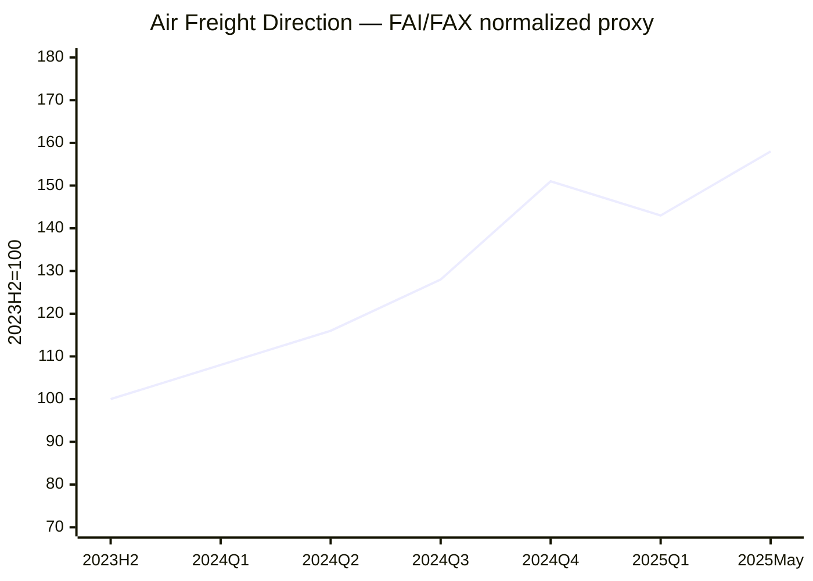

# Global Logistics Market Weekly Report – August 19, 2026 Week

**보고일:** 2026-08-19  
**ISO 주차:** 2026-W34  
**데이터 마감:** 2026-08-19, Asia/Seoul  
**작성 원칙:** 최신 공개 데이터 우선. 구독형 또는 부분 공개 지표는 공개 범위만 사용했으며, 확인되지 않은 값은 임의 추정하지 않았다. 계산치는 별도 표기했다.

---

## 1. Executive Summary

2026년 34주차 글로벌 물류시장은 **Transpacific 강세 유지, Asia–Europe 약세, 미국 7월 수입 증가, 중동 chokepoint 리스크의 재확대, 항공화물 운임의 완만한 재상승**이 동시에 나타나는 분화 시장이다.

Drewry World Container Index(WCI)는 최신 공개치인 2026년 8월 13일 **USD 4,339/40ft, WoW +1%**를 기록했다. Shanghai–New York은 **USD 8,706/40ft(+10%)**, Shanghai–Los Angeles는 **USD 6,244/40ft(+6%)**로 미국향이 상승을 주도했다. 반면 Shanghai–Rotterdam은 **USD 4,425/40ft(-5%)**, Shanghai–Genoa는 **USD 5,080/40ft(-8%)**로 유럽향은 빠르게 약화됐다. Drewry는 8월 17일~9월 20일 East–West 주요 항로에서 **49건의 blank sailing**, 전체 예정 항차의 약 **7%**가 취소될 것으로 전망했다.

SCFI는 Shanghai Shipping Exchange 공식 공개 페이지에서 현재 검증 가능한 최신 회차가 2026년 7월 31일 **3,205.97포인트**이며, 전주 3,062.95 대비 **+4.67% WoW**다. 최신 8월 회차는 공개 페이지의 검색·색인 시차 때문에 본 보고서에서 임의 추정하지 않았다.

Freightos Baltic Index(FBX) global current는 8월 19일 조회 기준 **USD 3,689.80/40ft**다. Freightos의 최신 공개 주간 lane 업데이트는 Asia–USWC 강세와 Asia–Europe 약세를 지속적으로 보여준다. Xeneta도 8월 12일 Far East–USWC **USD 6,965/FEU**, Far East–USEC **USD 10,249/FEU**, Far East–North Europe **USD 4,909/FEU**, Far East–Mediterranean **USD 5,846/FEU**를 제시했다. XSI composite 자체는 구독형이라 최신 수치를 공개 범위에서 검증할 수 없다.

미국 7월 컨테이너 수입은 Descartes 기준 **2,508,310 TEU, MoM +4.5%, YoY -4.3%**였다. 중국발은 **873,129 TEU, MoM +7.2%, YoY -5.4%**로 2025년 7월 이후 가장 높은 월간 수준이었다. 최근 Transpacific 가격 강세는 7월 수입 물량과 blank sailing이 동시에 작용한 결과지만, YoY 감소는 구조적 소비 호황과는 거리가 있음을 보여준다.

항공화물은 IATA 6월 글로벌 CTK **+8.5% YoY**, ACTK **+4.4%**, load factor **46.9%**로 수요가 공급보다 빠르게 늘었다. TAC Baltic Air Freight Index(BAI00)는 8월 17일 **2,425**, WoW **+0.2%**, YoY **+19.2%**였다. 이는 항공운임이 단기 급등은 아니더라도 전년보다 높은 가격대를 유지하고 있음을 의미한다.

**이번 주 핵심 결론은 명확하다.** “글로벌 운임이 상승” 또는 “글로벌 운임이 하락”이라는 단일 문장으로 시장을 설명하면 틀린다. 미국향 FCL은 강하고 유럽향은 약하다. 항공은 Asia outbound가 견조하고 Transatlantic은 belly capacity 때문에 상대적으로 안정적이다. 구매·판매 전략을 lane별로 분리해야 한다.

---

## 2. Ocean Freight Market Trends

### 2.1 Major Ocean Freight Index Updates

| 지표 | 데이터 기준일 | Latest value | WoW | YoY | 데이터 상태 |
|---|---:|---:|---:|---:|---|
| SCFI Composite | 2026-07-31 | 3,205.97 pts | +4.67% | 공개 미표시 | 공식 공개 최신 검증값 |
| Drewry WCI Composite | 2026-08-13 | USD 4,339/40ft | +1% | 공개 미표시 | 공식 공개 |
| WCI Shanghai–Los Angeles | 2026-08-13 | USD 6,244/40ft | +6% | 미표시 | 공식 공개 |
| WCI Shanghai–New York | 2026-08-13 | USD 8,706/40ft | +10% | 미표시 | 공식 공개 |
| WCI Shanghai–Rotterdam | 2026-08-13 | USD 4,425/40ft | -5% | 미표시 | 공식 공개 |
| WCI Shanghai–Genoa | 2026-08-13 | USD 5,080/40ft | -8% | 미표시 | 공식 공개 |
| Drewry IACI | 2026-08-13 | USD 1,028/40ft | +6% | 공개 미표시 | 공식 공개 |
| FBX Global | 2026-08-19 조회 | USD 3,689.80/40ft | 공개 미표시 | 공개 미표시 | Freightos public current |
| Xeneta FE–USWC | 2026-08-12 | USD 6,965/FEU | 공개 페이지에 WoW 미표시 | N/A | public market average |
| Xeneta FE–USEC | 2026-08-12 | USD 10,249/FEU | 공개 페이지에 WoW 미표시 | N/A | public market average |
| Xeneta FE–North Europe | 2026-08-12 | USD 4,909/FEU | 공개 페이지에 WoW 미표시 | N/A | public market average |
| Xeneta FE–Mediterranean | 2026-08-12 | USD 5,846/FEU | 공개 페이지에 WoW 미표시 | N/A | public market average |
| Xeneta XSI Composite | 2026-08-19 조회 | 최신 composite 비공개 | N/A | N/A | 구독형, 미추정 |

### 지수별 해석

**SCFI:** 공식 공개 페이지는 현재 7월 31일 회차까지 검증된다. 이 값은 전주 대비 +4.67%로 반등했지만, 이후 WCI와 Xeneta lane별 데이터에서 유럽향 하락이 확인되므로 SCFI 상승을 전체 시장의 상승 전환으로 해석하는 것은 부정확하다.

**WCI:** Composite +1%의 내부 구성이 중요하다. 미국 동부 +10%, 서부 +6% 대 북유럽 -5%, 지중해 -8%다. Transpacific은 blank sailing과 중국 항만 혼잡, 미국 수입물량이 가격을 지지하는 반면, Asia–Europe은 수요 약화가 선사의 FAK 인상 시도를 압도하고 있다.

**FBX:** Global current는 USD 3,689.80/40ft로 높은 수준이지만, 최근 Freightos 주간 데이터 역시 미국향과 유럽향의 방향 분화를 보여준다. FBX는 실제 digital booking 및 offered rate 기반 지표라는 점에서 단기 market temperature를 확인하는 데 유용하다.

**Xeneta/XSI:** Xeneta의 공개 spot market average는 미국 동부가 USD 10,000/FEU를 넘어 높은 수준이다. 반면 XSI composite는 구독형 데이터로, 이번 보고서에서는 숫자를 임의로 채우지 않았다. Xeneta는 중동 분쟁 충격이 장기계약 시장까지 전이되고 있다고 평가하며, 2월 말 대비 long-term rates가 USWC +41%, USEC +40%, North Europe +41%, Mediterranean +17% 상승했다고 밝혔다.

### 2.2 Ocean Freight Demand and Volume Trends

| 지역 / 지표 | 최신값 | MoM | YoY | 해석 |
|---|---:|---:|---:|---|
| U.S. total container imports | 2026년 7월 2,508,310 TEU | +4.5% | -4.3% | 계절적 증가, 전년 대비 약세 |
| China-origin U.S. imports | 873,129 TEU | +7.2% | -5.4% | 미국향 증가 주도 |
| Top-10 origin imports | 7월 | +4.9% | -5.3% | 전월 반등 |
| Global port throughput | 2026년 5월 | +1.5% | +2.0% | 완만한 성장 |
| China industrial output | 1~7월 | N/A | +5.3% | 공급능력 유지 |
| China retail sales | 1~7월 | N/A | +1.2% | 내수 약세 |

**Americas:** 7월 미국 수입은 전월 대비 4.5% 증가했지만 전년 대비 4.3% 감소했다. 즉 현재 높은 Transpacific 운임을 “미국 소비 호황”으로 설명하면 잘못이다. 화주의 선적 timing, 7월 관세정책 전환, 중국발 물량 증가와 선사의 공급관리 영향이 더 크다.

**Europe:** Asia–Europe은 미국향과 정반대다. 수요의 가격 지지력이 약하고 offered capacity 부담이 남아 있다. 중동 리스크가 war-risk, fuel, routing cost를 높이고 있지만 base freight 자체는 하락하고 있다.

**Asia:** 중국 1~7월 산업생산은 +5.3%, 제조업 +5.6%, high-tech manufacturing +13.8%였지만 소매판매는 +1.2%, 고정자산투자는 -6.7%였다. 공급 역량은 강하지만 내수는 약한 구조다. 이는 중국 기업의 수출 의존을 높여 origin supply는 충분하게 유지하는 반면 destination demand가 운임을 좌우하는 구조를 만든다.

### 2.3 Vessel Capacity Supply and Freight Rate Outlook

| 공급 변수 | 최신 상황 | 영향 |
|---|---|---|
| East–West blank sailings | Week 34~38 총 49건, 약 7% 취소 | 운임 하락 방어 |
| Transpacific 취소 비중 | 전체 취소의 59% | 미국향 space 타이트 |
| Asia–Europe/Med 취소 비중 | 27% | 일부 공급관리 |
| Newbuild deliveries | 구조적 공급 증가 지속 | 중기 하락 압력 |
| Asian port congestion | 기상·환적 허브 혼잡 | schedule reliability 저하 |
| Hormuz/Bab el-Mandeb | 통항 제한·우회 지속 | BAF·insurance 상승 |
| Panama Canal surcharge | 일부 carrier 적용 확대 | USEC/Gulf all-in 비용 상승 |

### 2~4주 운임 전망

- **Asia–USWC:** 강세 또는 고점 유지. 다만 7월 수입 peak가 지나면 9월부터 수요 약화 가능성이 커진다.
- **Asia–USEC:** 높은 절대 운임과 Panama Canal 관련 surcharge가 가격을 지지한다.
- **Asia–North Europe:** 하락 우위. 기존 buy rate를 적극적으로 재협상할 구간이다.
- **Asia–Mediterranean:** 약세 우위. 지정학 surcharge가 all-in 하락폭만 제한할 가능성이 높다.
- **Intra-Asia:** Drewry IACI +6%로 단기 반등했지만 장거리 시장과 동일한 추세로 볼 수 없다.
- **Korea/Vietnam origin:** 목적지별 가격 분화가 더 중요해진다. 미국향과 유럽향을 같은 validity와 margin policy로 운영하면 안 된다.

---

## 3. Air Freight Market Trends

### 3.1 Air Freight Rates and Demand Updates

| 지표 / 노선 | 데이터 기준일 | Latest value | WoW | YoY | 데이터 상태 |
|---|---:|---:|---:|---:|---|
| IATA Global CTK | 2026년 6월 | 성장률 +8.5% | 월간 | +8.5% | 공식 공개 |
| IATA Global ACTK | 2026년 6월 | 성장률 +4.4% | 월간 | +4.4% | 공식 공개 |
| IATA Cargo Load Factor | 2026년 6월 | 46.9% | +1.7%p YoY | +1.7%p | 공식 공개 |
| Asia-Pacific CTK | 2026년 6월 | +7.9% | 월간 | +7.9% | 공식 공개 |
| North America CTK | 2026년 6월 | +13.1% | 월간 | +13.1% | 공식 공개 |
| Europe CTK | 2026년 6월 | +6.9% | 월간 | +6.9% | 공식 공개 |
| Middle East CTK | 2026년 6월 | +5.6% | 월간 | +5.6% | 공식 공개 |
| TAC BAI00 | 2026-08-17 | 2,425 | +0.2% | +19.2% | 공식 dashboard |
| FAX China–North America | 최근 공개 주간치 | 약 USD 6/kg 수준 | 주간 변동성 확대 | N/A | Freightos public partial |
| FAX China–Europe | 최근 공개 주간치 | 약 USD 4/kg 수준 | 주간 변동성 확대 | N/A | Freightos public partial |
| FAX North Europe–North America | 최근 공개 주간치 | 절대값 공개 제한 | 상대적으로 안정 | N/A | public partial |

### 시장 해석

항공은 해상보다 실수요가 강하다. IATA 6월 CTK +8.5%가 ACTK +4.4%보다 빠르게 증가해 load factor가 개선됐다. 특히 North America CTK +13.1%는 AI, 반도체, 전자제품 및 e-commerce 수요를 반영한다.

TAC BAI00은 8월 17일 2,425로 WoW +0.2%, YoY +19.2%다. 폭발적인 주간 상승은 아니지만, 1년 전보다 운임 레벨이 확실히 높다. Hong Kong outbound BAI30도 TAC 메인 페이지에 8월 17일 최신값이 노출되고 있어 Asia outbound air market의 높은 가격 수준을 확인할 수 있다.

### 3.2 Air Freight Market Issues and Outlook

**E-commerce / de minimis:** 미국의 de minimis 폐지 이후 direct parcel 모델은 구조적으로 약해졌고, EU도 2026년 7월 1일부터 저가 소포에 €3 customs fee를 적용했다. 이 변화는 항공물량을 완전히 없애기보다 bulk consolidation, bonded fulfillment, 일반 air cargo로 이동시키는 효과가 크다.

**Belly capacity:** Europe–North America는 여객편 공급 확대가 운임 상승을 제한한다. 반면 Asia–North America는 AI hardware와 전자제품 수요가 belly capacity 증가를 상쇄하고 있다.

**Middle East:** 항공운임에 가장 큰 비수요 요인은 fuel과 network disruption이다. Gulf hub capacity가 완전히 정상화되지 않았고, Hormuz 및 Red Sea 리스크가 jet fuel과 war-risk surcharge를 지지한다.

### 2~4주 전망

- **China/Korea–North America:** firm. 전자·AI cargo 중심으로 높은 레벨 유지 가능.
- **China/Korea–Europe:** 보합~소폭 강세. fuel surcharge와 capacity reallocation이 변수.
- **Europe–North America:** 상대적으로 안정적.
- **Middle East-linked:** 가장 높은 운영·보험·연료 리스크.

---

## 4. Policy and Macroeconomic Issues

### 4.1 Trump 2.0 Tariff Policies and Trade Disputes

미국의 관세체계는 현재 “전면 관세”보다 더 복잡한 형태로 재구성됐다. USTR은 7월 23일 forced-labor import prohibition을 근거로 60개 경제권에 Section 301 추가관세를 최종 확정했다. 강제노동 상품 수입금지 체계를 도입하거나 미국과 관련 약정을 체결한 국가에는 10%, 그렇지 않은 다수 국가에는 12.5% 추가관세가 적용된다. USTR에 따르면 대상 경제권은 미국 수입의 99.4%를 차지한다. FreightWaves는 이 조치가 7월 24일부터 시행됐으며 수입업체들이 법원 소송을 제기했지만, 소송이 진행되는 동안 관세는 계속 납부해야 한다고 보도했다.

이 정책이 물류시장에 미치는 영향은 headline tariff보다 더 복잡하다. 첫째, 화주는 관세 적용일 전에 물량을 앞당기기 때문에 특정 월의 container volume과 spot rate가 실제 소비수요보다 과장될 수 있다. 7월 미국 수입이 MoM +4.5%였지만 YoY -4.3%인 것은 이 왜곡을 잘 보여준다. 둘째, China+1 전략이 진행돼도 원산지 판정은 단순 선적국이 아니라 substantial transformation을 기준으로 하기 때문에 생산공정·부품·공급망 증빙을 함께 바꾸지 않으면 tariff exposure가 줄지 않는다. 셋째, 관세 비용은 단순 customs duty가 아니라 inventory financing, bonded storage, customs hold, inspection, D&D까지 확대된다.

실무적으로는 고객의 HS code, MFN tariff, Section 301/232 중첩 여부, forced-labor supplier traceability를 booking 이전 단계에서 확인해야 한다. “관세는 화주 부담”이라는 면책 문구 하나로 리스크를 끝내려는 접근은 너무 단순하다. 화주가 필요한 것은 선적일·도착일·통관일별 landed cost scenario다.

기업 대응도 이미 달라지고 있다. 일부 수입업체는 중국 의존도를 낮추기 위해 베트남·인도·멕시코 등으로 sourcing을 분산하고, 일부는 bonded warehouse나 FTZ를 활용해 관세 납부 시점을 늦추고 있다. 하지만 공급망 이전에는 품질, 생산능력, 원산지 요건, inland logistics 검증이 필요하기 때문에 단기간에 끝나는 프로젝트가 아니다.

### 4.2 De Minimis and E-commerce

미국은 2025년부터 de minimis 면세 범위를 단계적으로 축소했고, EU는 2026년 7월부터 저가 소포에 추가 customs fee를 부과하고 있다. 이는 Temu·Shein형 direct-to-consumer model의 원가 구조를 바꾼다. FreightWaves가 보도한 사례처럼 parcel당 통관·수수료 부담이 늘면 direct parcel 물량은 감소하지만, 화물이 완전히 사라지는 것은 아니다.

대량 consolidation, 일반 항공, bonded warehouse, 현지 fulfillment로의 전환이 빨라질 가능성이 높다. 따라서 Forwarder에게는 express rate 자체보다 customs brokerage, bonded inventory, return handling, last-mile를 결합한 total landed cost 설계 능력이 더 중요해진다.

### 4.3 Red Sea, Hormuz and Energy Risk

8월 18~19일 중동 해상 리스크는 다시 커졌다. Reuters에 따르면 Hormuz 통항은 8월 19일 기준 하루 6척 수준까지 감소했고, 10일 평균 11척에도 못 미쳤다. 이란은 해협이 여전히 폐쇄됐다고 주장하는 반면 미국은 “열려 있다”고 주장해 실제 운영환경의 불확실성이 매우 높다. 중국 국영 해운사들도 Hormuz 및 Bab el-Mandeb 위험회피를 위해 Gulf 밖에서 STS 방식으로 원유를 받는 등 우회전략을 확대하고 있다.

Saudi Aramco가 Hormuz 내부 항만에서 원유 선적을 일부 재개한 것은 긍정적이지만 정상화를 의미하지는 않는다. 일본 Idemitsu는 Saudi crude를 Suez 및 Cape route로 조달하면서 기존 20일 수준 운송기간이 50~60일까지 늘어날 수 있다고 밝혔다. 이것이 현재 중동 리스크의 본질이다. 컨테이너선만 보는 것이 아니라 tanker, bunker, jet fuel, insurance, inventory lead time 전체를 봐야 한다.

Brent crude는 8월 19일 약 USD 91.7/bbl 수준까지 상승했다. 이런 유가 환경에서는 Europe lane의 base freight가 떨어져도 BAF, Emergency Fuel Surcharge, war-risk premium이 all-in 운송비 하락을 제한할 수 있다.

### 4.4 U.S. Federal Reserve, ECB and Inflation

Fed는 7월 29일 기준금리 목표범위를 **3.50~3.75%**로 동결했다. 표결은 9대3이었다. 미국 7월 CPI는 **MoM +0.1%, YoY +3.4%**, core CPI는 **MoM +0.2%, YoY +2.5%**로 6월보다 소폭 둔화됐다. PPI는 7월 MoM 0.0%, YoY +4.7%였다. headline CPI는 안정됐지만 energy inflation이 여전히 높고, PPI core pressure도 완전히 사라지지 않았다.

물류에 중요한 것은 금리 자체보다 inventory financing cost다. 5~7월 선반입한 기업들은 관세를 피했더라도 높은 금리와 보관비를 감당해야 한다. 이것은 8~9월 신규 주문을 억제할 수 있다.

ECB는 7월 23일 deposit facility 2.25%, main refinancing 2.40%, marginal lending 2.65%를 동결했다. 유럽은 성장 둔화에도 중동 에너지 충격이 2차 인플레이션으로 번질 가능성 때문에 빠른 완화에 제약이 있다.

### 4.5 China Policies and Economic Outlook

중국 국가통계국의 8월 17일 발표에 따르면 1~7월 산업생산은 **+5.3% YoY**, 제조업은 +5.6%, high-tech manufacturing은 +13.8%였다. 반면 소매판매는 **+1.2%**, 고정자산투자는 **-6.7%**, 부동산 개발투자는 **-19.2%**였다. 7월 CPI는 +0.5%, PPI는 +3.5% YoY였다.

이 데이터의 메시지는 분명하다. 중국은 공급능력과 첨단 제조는 강하지만 내수는 약하다. 수출은 1~7월 +14.0%, 수입은 +22.0%로 강했다. 물류시장에서는 origin cargo supply가 부족한 것이 아니라 destination demand와 관세가 병목이라는 의미다.

IMF는 2026년 세계성장률을 **3.0%**, 2027년 **3.4%**로 전망하며 2026년 글로벌 headline inflation을 **4.7%**로 보고 있다. AI·첨단산업 투자가 성장을 지지하지만 전쟁과 에너지가 비용을 높이는 구조다.

**정책·거시 결론:** 2026년 하반기 글로벌 물류는 경기 방향 하나로 움직이지 않는다. 미국은 tariff timing, 유럽은 약한 수요, 중국은 강한 공급과 약한 내수, 중동은 fuel·insurance risk가 시장을 각각 다른 방향으로 끌고 있다. 따라서 평균 index보다 lane, commodity, surcharge 단위 관리가 훨씬 중요하다.

---

## 5. Comprehensive Impact on Logistics Sectors

| 부문 | 시장 영향 | 주요 리스크 | 권고 대응 |
|---|---|---|---|
| Ocean FCL – U.S. | 고운임 유지 | blank sailing·GRI | 1~2주 분할매입 |
| Ocean FCL – Europe | 하락세 | 고가 buy 유지 | 즉시 재협상 |
| Ocean LCL | FCL 변동 후행 | buy/sell mismatch | 주간 원가 업데이트 |
| Air Freight | Asia outbound 견조 | fuel·capacity | direct/deferred 분리 |
| Customs | Section 301 확대 | 추징·hold | HS/COO/traceability 점검 |
| Warehousing | frontloading 재고 잔존 | 금융·보관비 | bonded/FTZ 활용 |
| Inland | 항만·수로별 편차 | D&D·delay | port-specific plan |
| Sales | lane별 방향 상충 | composite index 오판 | lane-specific market note |
| Risk | Hormuz·Red Sea | insurance·fuel·ETA | war-risk/routing clause |

---

## 6. Conclusion / Recommendations

### 결론

2026년 34주차 시장은 **미국향 해상운임 강세와 유럽향 약세, 항공의 높은 수요 증가율, 중동 리스크의 지속**이 동시에 존재한다.

가장 큰 오류는 WCI +1%나 FBX global 한 숫자만 보고 “운임이 다시 오른다”고 결론내리는 것이다. 실제 WCI 세부노선은 New York +10%, Los Angeles +6% 대 Rotterdam -5%, Genoa -8%다.

미국향은 7월 수입량 2.508M TEU와 blank sailing이 가격을 지지하고 있지만 YoY -4.3%이므로 구조적 수요 호황은 아니다. 유럽향은 buy rate를 재협상할 구간이다. 항공은 CTK +8.5%, BAI00 YoY +19.2%로 여전히 높은 레벨이다.

### 권고사항

1. **미국향 FCL:** 1~2주 단위 분할매입. 장기 fixed buy 최소화.
2. **유럽향 FCL:** 현재 buy rate 즉시 재협상.
3. Quote validity는 **3~5일** 유지.
4. Base freight와 GRI/PSS, BAF/EFS, war-risk surcharge를 분리.
5. 미국향 고객에게 7월 MoM +4.5%와 YoY -4.3%를 함께 설명.
6. 항공은 China/Korea–North America와 Europe–North America에 다른 pricing logic 적용.
7. Section 301 대상은 HS/COO/forced-labor traceability를 booking 전에 점검.
8. Hormuz 관련 뉴스는 헤드라인보다 **actual vessel traffic, fuel, insurance**를 기준으로 판단.

---

## 7. Historical Rate Direction Charts

> 아래 그래프는 2023년 하반기~2025년 5월의 공개 FBX 및 FAI/FAX 시장 흐름을 2023H2=100으로 정규화한 **방향성 참고치**다. 유료 원시 시계열이 아니므로 계약·정산용으로 사용할 수 없다.

---

## 8. Sources

1. Shanghai Shipping Exchange, SCFI.  
   https://www.sse.net.cn/index/singleIndex?indexType=scfi
2. Drewry, World Container Index – 13 Aug 2026.  
   https://www.drewry.co.uk/supply-chain-advisors/supply-chain-expertise/world-container-index-assessed-by-drewry
3. Drewry, Cancelled Sailings Tracker – 14 Aug 2026.  
   https://www.drewry.co.uk/supply-chain-advisors/supply-chain-expertise/cancelled-sailings-tracker
4. Freightos, Freightos Baltic Index Global, accessed 2026-08-19.  
   https://www.freightos.com/enterprise/terminal/freightos-baltic-index-global-container-pricing-index/
5. Xeneta, Weekly Ocean Container Shipping Market Update – 13 Aug 2026.  
   https://www.xeneta.com/news/xeneta-weekly-ocean-container-shipping-market-update-13.08.26
6. Descartes, August Global Shipping Report – July U.S. imports.  
   https://www.descartes.com/resources/knowledge-center/descartes-releases-august-global-shipping-report-july-us-containerized
7. IATA, Air Cargo Demand Strengthens in June, Up 8.5%, 2026-07-29.  
   https://www.iata.org/en/pressroom/2026-releases/07-29-air-cargo-demand-strengthens-june/
8. TAC Index, BAI00 Air Freight Market Dashboard, 2026-08-17.  
   https://dashboard.tacindex.com/detail?route=BAI00&routeType=basket
9. USTR, Forced Labor Section 301 Investigations – Final Action, 2026-07-23.  
   https://ustr.gov/about/policy-offices/press-office/press-releases/2026/july/ustr-takes-action-forced-labor-section-301-investigations
10. FreightWaves, Importers sue over forced labor tariffs on 60 economies, 2026-07-28.  
    https://www.freightwaves.com/news/forced-labor-tariffs-lawsuits
11. Federal Reserve, FOMC Statement, 2026-07-29.  
    https://www.federalreserve.gov/newsevents/pressreleases/monetary20260729a.htm
12. U.S. Bureau of Labor Statistics, CPI July 2026.  
    https://www.bls.gov/news.release/cpi.nr0.htm
13. U.S. Bureau of Labor Statistics, PPI July 2026.  
    https://www.bls.gov/news.release/archives/ppi_08132026.htm
14. ECB, Monetary Policy Decisions, 2026-07-23.  
    https://www.ecb.europa.eu/press/pr/date/2026/html/ecb.mp260723~29f24d99bc.en.html
15. National Bureau of Statistics of China, National Economy in First Seven Months, 2026-08-17.  
    https://www.stats.gov.cn/english/PressRelease/202608/t20260817_1965057.html
16. National Bureau of Statistics of China, CPI July 2026.  
    https://www.stats.gov.cn/english/PressRelease/202608/t20260810_1965018.html
17. National Bureau of Statistics of China, PPI July 2026.  
    https://www.stats.gov.cn/english/PressRelease/202608/t20260810_1965017.html
18. IMF, World Economic Outlook Update, July 2026.  
    https://www.imf.org/en/publications/weo
19. Reuters, Hormuz traffic slows amid uncertainty, 2026-08-19.  
    https://www.reuters.com/world/middle-east/hormuz-traffic-slows-uncertainty-over-waterway-persists-2026-08-19/
20. Reuters, Saudi Arabia resumes oil loadings inside Hormuz, 2026-08-18.  
    https://www.reuters.com/business/energy/saudi-arabia-resumes-oil-loadings-sales-inside-strait-hormuz-2026-08-18/
21. Reuters, Idemitsu sources Saudi crude via Suez/Cape routes, 2026-08-18.  
    https://www.reuters.com/business/energy/idemitsu-starts-sourcing-saudi-crude-via-suez-route-sees-no-risk-stable-supplies-2026-08-18/
22. MacroMicro, U.S. and China inflation dashboards, accessed 2026-08-19.  
    https://en.macromicro.me/charts/10/cpi  
    https://en.macromicro.me/charts/225/cn-cpi
